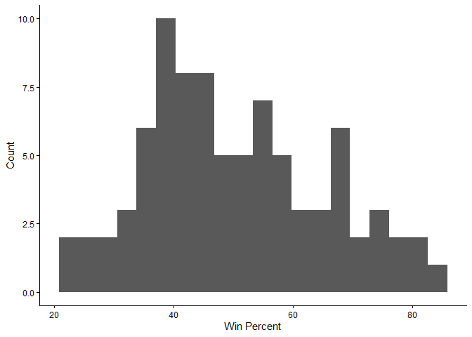
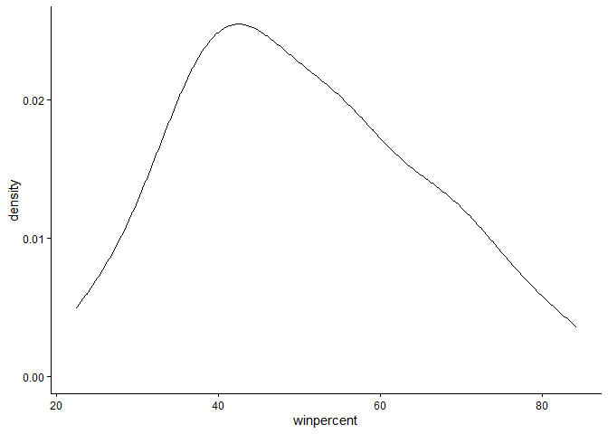
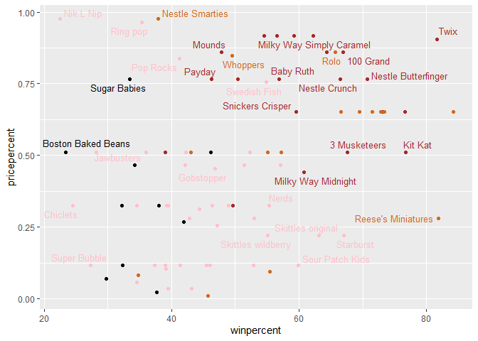
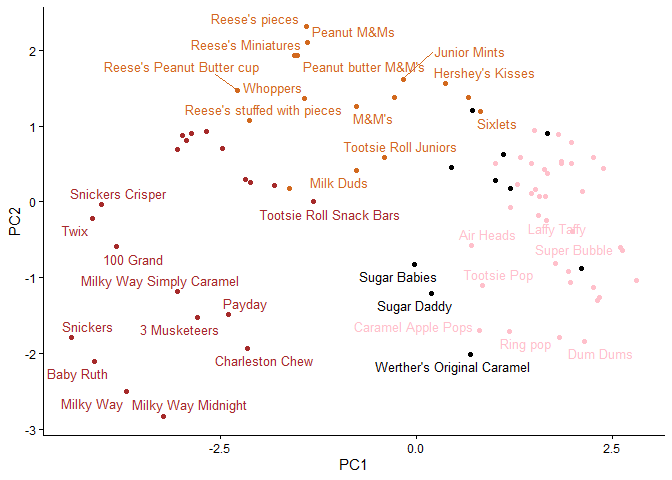
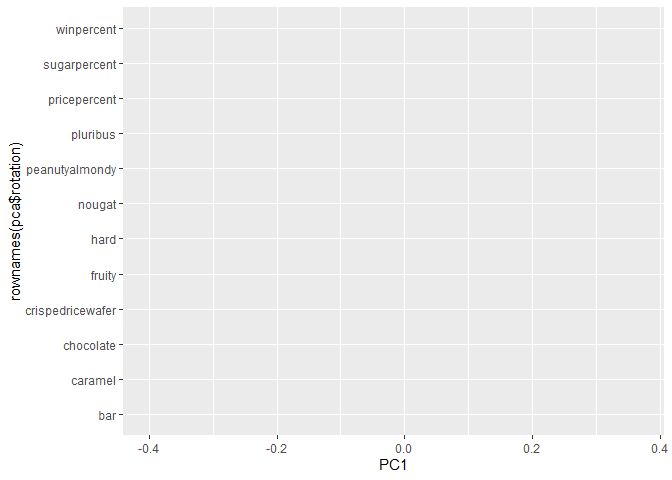

# Class 10
Kavi Gonur (PID: A69046927)

## Importing candy data

``` r
candy_file <- read.csv("https://raw.githubusercontent.com/fivethirtyeight/data/master/candy-power-ranking/candy-data.csv")

candy = data.frame(candy_file, row.names=1)
head(candy)
```

                 chocolate fruity caramel peanutyalmondy nougat crispedricewafer
    100 Grand            1      0       1              0      0                1
    3 Musketeers         1      0       0              0      1                0
    One dime             0      0       0              0      0                0
    One quarter          0      0       0              0      0                0
    Air Heads            0      1       0              0      0                0
    Almond Joy           1      0       0              1      0                0
                 hard bar pluribus sugarpercent pricepercent winpercent
    100 Grand       0   1        0        0.732        0.860   66.97173
    3 Musketeers    0   1        0        0.604        0.511   67.60294
    One dime        0   0        0        0.011        0.116   32.26109
    One quarter     0   0        0        0.011        0.511   46.11650
    Air Heads       0   0        0        0.906        0.511   52.34146
    Almond Joy      0   1        0        0.465        0.767   50.34755

> Q1. How many different candy types are in this dataset?

There are 85 different candy types in the dataset.

> Q2. How many fruity candy types are in the dataset?

There are 38 fruity candy types in the dataset.

## What is your favorate candy?

> Q3. What is your favorite candy in the dataset and what is it’s
> winpercent value?

I have a ton of favorite candies. How dare you make me choose. ;-; But I
suppose right now I like fruitier candy so Haribo Happy Cola. Its
winpercent is 34.158958%.

> Q4. What is the winpercent value for “Kit Kat”?

76.7686%

> Q5. What is the winpercent value for “Tootsie Roll Snack Bars”?

49.653503%

``` r
library("skimr")
skim(candy)
```

|                                                  |       |
|:-------------------------------------------------|:------|
| Name                                             | candy |
| Number of rows                                   | 85    |
| Number of columns                                | 12    |
| \_\_\_\_\_\_\_\_\_\_\_\_\_\_\_\_\_\_\_\_\_\_\_   |       |
| Column type frequency:                           |       |
| numeric                                          | 12    |
| \_\_\_\_\_\_\_\_\_\_\_\_\_\_\_\_\_\_\_\_\_\_\_\_ |       |
| Group variables                                  | None  |

Data summary

**Variable type: numeric**

| skim_variable | n_missing | complete_rate | mean | sd | p0 | p25 | p50 | p75 | p100 | hist |
|:---|---:|---:|---:|---:|---:|---:|---:|---:|---:|:---|
| chocolate | 0 | 1 | 0.44 | 0.50 | 0.00 | 0.00 | 0.00 | 1.00 | 1.00 | ▇▁▁▁▆ |
| fruity | 0 | 1 | 0.45 | 0.50 | 0.00 | 0.00 | 0.00 | 1.00 | 1.00 | ▇▁▁▁▆ |
| caramel | 0 | 1 | 0.16 | 0.37 | 0.00 | 0.00 | 0.00 | 0.00 | 1.00 | ▇▁▁▁▂ |
| peanutyalmondy | 0 | 1 | 0.16 | 0.37 | 0.00 | 0.00 | 0.00 | 0.00 | 1.00 | ▇▁▁▁▂ |
| nougat | 0 | 1 | 0.08 | 0.28 | 0.00 | 0.00 | 0.00 | 0.00 | 1.00 | ▇▁▁▁▁ |
| crispedricewafer | 0 | 1 | 0.08 | 0.28 | 0.00 | 0.00 | 0.00 | 0.00 | 1.00 | ▇▁▁▁▁ |
| hard | 0 | 1 | 0.18 | 0.38 | 0.00 | 0.00 | 0.00 | 0.00 | 1.00 | ▇▁▁▁▂ |
| bar | 0 | 1 | 0.25 | 0.43 | 0.00 | 0.00 | 0.00 | 0.00 | 1.00 | ▇▁▁▁▂ |
| pluribus | 0 | 1 | 0.52 | 0.50 | 0.00 | 0.00 | 1.00 | 1.00 | 1.00 | ▇▁▁▁▇ |
| sugarpercent | 0 | 1 | 0.48 | 0.28 | 0.01 | 0.22 | 0.47 | 0.73 | 0.99 | ▇▇▇▇▆ |
| pricepercent | 0 | 1 | 0.47 | 0.29 | 0.01 | 0.26 | 0.47 | 0.65 | 0.98 | ▇▇▇▇▆ |
| winpercent | 0 | 1 | 50.32 | 14.71 | 22.45 | 39.14 | 47.83 | 59.86 | 84.18 | ▃▇▆▅▂ |

> Q6. Is there any variable/column that looks to be on a different scale
> to the majority of the other columns in the dataset?

Yes. winpercent.

> Q7. What do you think a zero and one represent for the
> candy\$chocolate column?

0 = candy is NOT a chocolate. 1 = candy IS a chocolate.

> Q8. Plot a histogram of winpercent values

``` r
library(ggplot2)
ggplot(candy) +
  aes(x=winpercent) +
  theme_classic() +
  geom_histogram(bins=20) +
  labs(x="Win Percent", y= "Count")
```



> Q9. Is the distribution of winpercent values symmetrical?

``` r
ggplot(candy) +
  aes(x=winpercent) +
  theme_classic() +
  geom_density()
```



Nope

> Q10. Is the center of the distribution above or below 50%?

``` r
summary(candy$winpercent)
```

       Min. 1st Qu.  Median    Mean 3rd Qu.    Max. 
      22.45   39.14   47.83   50.32   59.86   84.18 

According to the mean, above. But the median is below.

> Q11. On average is chocolate candy higher or lower ranked than fruit
> candy?

``` r
# 1. Find all chocolate candy in the dataset
choc.inds <- as.logical(candy$chocolate)
choc.candy <- candy[choc.inds,]
choc.candy
```

                                chocolate fruity caramel peanutyalmondy nougat
    100 Grand                           1      0       1              0      0
    3 Musketeers                        1      0       0              0      1
    Almond Joy                          1      0       0              1      0
    Baby Ruth                           1      0       1              1      1
    Charleston Chew                     1      0       0              0      1
    Hershey's Kisses                    1      0       0              0      0
    Hershey's Krackel                   1      0       0              0      0
    Hershey's Milk Chocolate            1      0       0              0      0
    Hershey's Special Dark              1      0       0              0      0
    Junior Mints                        1      0       0              0      0
    Kit Kat                             1      0       0              0      0
    Peanut butter M&M's                 1      0       0              1      0
    M&M's                               1      0       0              0      0
    Milk Duds                           1      0       1              0      0
    Milky Way                           1      0       1              0      1
    Milky Way Midnight                  1      0       1              0      1
    Milky Way Simply Caramel            1      0       1              0      0
    Mounds                              1      0       0              0      0
    Mr Good Bar                         1      0       0              1      0
    Nestle Butterfinger                 1      0       0              1      0
    Nestle Crunch                       1      0       0              0      0
    Peanut M&Ms                         1      0       0              1      0
    Reese's Miniatures                  1      0       0              1      0
    Reese's Peanut Butter cup           1      0       0              1      0
    Reese's pieces                      1      0       0              1      0
    Reese's stuffed with pieces         1      0       0              1      0
    Rolo                                1      0       1              0      0
    Sixlets                             1      0       0              0      0
    Nestle Smarties                     1      0       0              0      0
    Snickers                            1      0       1              1      1
    Snickers Crisper                    1      0       1              1      0
    Tootsie Pop                         1      1       0              0      0
    Tootsie Roll Juniors                1      0       0              0      0
    Tootsie Roll Midgies                1      0       0              0      0
    Tootsie Roll Snack Bars             1      0       0              0      0
    Twix                                1      0       1              0      0
    Whoppers                            1      0       0              0      0
                                crispedricewafer hard bar pluribus sugarpercent
    100 Grand                                  1    0   1        0        0.732
    3 Musketeers                               0    0   1        0        0.604
    Almond Joy                                 0    0   1        0        0.465
    Baby Ruth                                  0    0   1        0        0.604
    Charleston Chew                            0    0   1        0        0.604
    Hershey's Kisses                           0    0   0        1        0.127
    Hershey's Krackel                          1    0   1        0        0.430
    Hershey's Milk Chocolate                   0    0   1        0        0.430
    Hershey's Special Dark                     0    0   1        0        0.430
    Junior Mints                               0    0   0        1        0.197
    Kit Kat                                    1    0   1        0        0.313
    Peanut butter M&M's                        0    0   0        1        0.825
    M&M's                                      0    0   0        1        0.825
    Milk Duds                                  0    0   0        1        0.302
    Milky Way                                  0    0   1        0        0.604
    Milky Way Midnight                         0    0   1        0        0.732
    Milky Way Simply Caramel                   0    0   1        0        0.965
    Mounds                                     0    0   1        0        0.313
    Mr Good Bar                                0    0   1        0        0.313
    Nestle Butterfinger                        0    0   1        0        0.604
    Nestle Crunch                              1    0   1        0        0.313
    Peanut M&Ms                                0    0   0        1        0.593
    Reese's Miniatures                         0    0   0        0        0.034
    Reese's Peanut Butter cup                  0    0   0        0        0.720
    Reese's pieces                             0    0   0        1        0.406
    Reese's stuffed with pieces                0    0   0        0        0.988
    Rolo                                       0    0   0        1        0.860
    Sixlets                                    0    0   0        1        0.220
    Nestle Smarties                            0    0   0        1        0.267
    Snickers                                   0    0   1        0        0.546
    Snickers Crisper                           1    0   1        0        0.604
    Tootsie Pop                                0    1   0        0        0.604
    Tootsie Roll Juniors                       0    0   0        0        0.313
    Tootsie Roll Midgies                       0    0   0        1        0.174
    Tootsie Roll Snack Bars                    0    0   1        0        0.465
    Twix                                       1    0   1        0        0.546
    Whoppers                                   1    0   0        1        0.872
                                pricepercent winpercent
    100 Grand                          0.860   66.97173
    3 Musketeers                       0.511   67.60294
    Almond Joy                         0.767   50.34755
    Baby Ruth                          0.767   56.91455
    Charleston Chew                    0.511   38.97504
    Hershey's Kisses                   0.093   55.37545
    Hershey's Krackel                  0.918   62.28448
    Hershey's Milk Chocolate           0.918   56.49050
    Hershey's Special Dark             0.918   59.23612
    Junior Mints                       0.511   57.21925
    Kit Kat                            0.511   76.76860
    Peanut butter M&M's                0.651   71.46505
    M&M's                              0.651   66.57458
    Milk Duds                          0.511   55.06407
    Milky Way                          0.651   73.09956
    Milky Way Midnight                 0.441   60.80070
    Milky Way Simply Caramel           0.860   64.35334
    Mounds                             0.860   47.82975
    Mr Good Bar                        0.918   54.52645
    Nestle Butterfinger                0.767   70.73564
    Nestle Crunch                      0.767   66.47068
    Peanut M&Ms                        0.651   69.48379
    Reese's Miniatures                 0.279   81.86626
    Reese's Peanut Butter cup          0.651   84.18029
    Reese's pieces                     0.651   73.43499
    Reese's stuffed with pieces        0.651   72.88790
    Rolo                               0.860   65.71629
    Sixlets                            0.081   34.72200
    Nestle Smarties                    0.976   37.88719
    Snickers                           0.651   76.67378
    Snickers Crisper                   0.651   59.52925
    Tootsie Pop                        0.325   48.98265
    Tootsie Roll Juniors               0.511   43.06890
    Tootsie Roll Midgies               0.011   45.73675
    Tootsie Roll Snack Bars            0.325   49.65350
    Twix                               0.906   81.64291
    Whoppers                           0.848   49.52411

``` r
# 2. Extract their `winpercent` values
choc.win <- choc.candy$winpercent

# 3. Find the mean of these values
choc.mean <- mean(choc.win)

# 4-6. Do the same for fruity candy
fruity.inds <- as.logical(candy$fruity)
fruity.candy <- candy[fruity.inds,]
fruity.win <- fruity.candy$winpercent
fruity.mean <- mean(fruity.win)
fruity.mean
```

    [1] 44.11974

``` r
# 7. Which mean value is higher?
if (fruity.mean > choc.mean) {
  print("Fruity")
} else {
  print("Chocolate")
}
```

    [1] "Chocolate"

> Q12. Is this difference statistically significant?

``` r
t.test(choc.win,fruity.win)
```


        Welch Two Sample t-test

    data:  choc.win and fruity.win
    t = 6.2582, df = 68.882, p-value = 2.871e-08
    alternative hypothesis: true difference in means is not equal to 0
    95 percent confidence interval:
     11.44563 22.15795
    sample estimates:
    mean of x mean of y 
     60.92153  44.11974 

## Overall Candy Rankings

> Q13. What are the five least liked candy types in this set?

``` r
library(dplyr)
```


    Attaching package: 'dplyr'

    The following objects are masked from 'package:stats':

        filter, lag

    The following objects are masked from 'package:base':

        intersect, setdiff, setequal, union

``` r
candy %>% 
arrange(winpercent) %>% 
head(5)
```

                       chocolate fruity caramel peanutyalmondy nougat
    Nik L Nip                  0      1       0              0      0
    Boston Baked Beans         0      0       0              1      0
    Chiclets                   0      1       0              0      0
    Super Bubble               0      1       0              0      0
    Jawbusters                 0      1       0              0      0
                       crispedricewafer hard bar pluribus sugarpercent pricepercent
    Nik L Nip                         0    0   0        1        0.197        0.976
    Boston Baked Beans                0    0   0        1        0.313        0.511
    Chiclets                          0    0   0        1        0.046        0.325
    Super Bubble                      0    0   0        0        0.162        0.116
    Jawbusters                        0    1   0        1        0.093        0.511
                       winpercent
    Nik L Nip            22.44534
    Boston Baked Beans   23.41782
    Chiclets             24.52499
    Super Bubble         27.30386
    Jawbusters           28.12744

> Q14. What are the top 5 all time favorite candy types out of this set?

``` r
library(dplyr)
candy %>% 
arrange(winpercent) %>% 
tail(5)
```

                              chocolate fruity caramel peanutyalmondy nougat
    Snickers                          1      0       1              1      1
    Kit Kat                           1      0       0              0      0
    Twix                              1      0       1              0      0
    Reese's Miniatures                1      0       0              1      0
    Reese's Peanut Butter cup         1      0       0              1      0
                              crispedricewafer hard bar pluribus sugarpercent
    Snickers                                 0    0   1        0        0.546
    Kit Kat                                  1    0   1        0        0.313
    Twix                                     1    0   1        0        0.546
    Reese's Miniatures                       0    0   0        0        0.034
    Reese's Peanut Butter cup                0    0   0        0        0.720
                              pricepercent winpercent
    Snickers                         0.651   76.67378
    Kit Kat                          0.511   76.76860
    Twix                             0.906   81.64291
    Reese's Miniatures               0.279   81.86626
    Reese's Peanut Butter cup        0.651   84.18029

> Q15. Make a first barplot of candy ranking based on winpercent values.

``` r
library(ggplot2)
ggplot(candy) + 
  aes(winpercent, rownames(candy)) +
  geom_col()
```


> Q16. This is quite ugly, use the reorder() function to get the bars
> sorted by winpercent?

``` r
ggplot(candy) + 
  aes(winpercent, reorder(rownames(candy),winpercent)) +
  geom_col()
```


### Time to add some useful color

``` r
my_cols=rep("black", nrow(candy))
my_cols[as.logical(candy$chocolate)] = "chocolate"
my_cols[as.logical(candy$bar)] = "brown"
my_cols[as.logical(candy$fruity)] = "pink"

ggplot(candy) + 
  aes(winpercent, reorder(rownames(candy),winpercent)) +
  geom_col(fill=my_cols)
```


> Q17. What is the worst ranked chocolate candy?

Sixlets

> Q18. What is the best ranked fruity candy?

Starburst

## Taking a look at pricepercent

``` r
library(ggrepel)

# How about a plot of price vs win
ggplot(candy) +
  aes(winpercent, pricepercent, label=rownames(candy)) +
  geom_point(col=my_cols) + 
  geom_text_repel(col=my_cols, size=3.3, max.overlaps = 5)
```

    Warning: ggrepel: 54 unlabeled data points (too many overlaps). Consider
    increasing max.overlaps



> Q19. Which candy type is the highest ranked in terms of winpercent for
> the least money - i.e. offers the most bang for your buck?

``` r
ord <- order(candy$pricepercent, decreasing = FALSE)
head( candy[ord,c("pricepercent", "winpercent")], n=5 )
```

                         pricepercent winpercent
    Tootsie Roll Midgies        0.011   45.73675
    Pixie Sticks                0.023   37.72234
    Dum Dums                    0.034   39.46056
    Fruit Chews                 0.034   43.08892
    Strawberry bon bons         0.058   34.57899

Tootsie Roll Midgies

> Q20. What are the top 5 most expensive candy types in the dataset and
> of these which is the least popular?

``` r
ord <- order(candy$pricepercent, decreasing = TRUE)
head( candy[ord,c("pricepercent", "winpercent")], n=5 )
```

                             pricepercent winpercent
    Nik L Nip                       0.976   22.44534
    Nestle Smarties                 0.976   37.88719
    Ring pop                        0.965   35.29076
    Hershey's Krackel               0.918   62.28448
    Hershey's Milk Chocolate        0.918   56.49050

Nik L Nips

> Q21. Make a barplot again with geom_col() this time using pricepercent
> and then improve this step by step, first ordering the x-axis by value
> and finally making a so called “dot chat” or “lollipop” chart by
> swapping geom_col() for geom_point() + geom_segment()

``` r
ggplot(candy) +
  aes(pricepercent, reorder(rownames(candy), pricepercent)) +
  geom_segment(aes(yend = reorder(rownames(candy), pricepercent), 
                   xend = 0), col="gray40") +
    geom_point()
```


## Exploring the correlation structure

``` r
library(corrplot)
```

    corrplot 0.95 loaded

``` r
cij <- cor(candy)
cij
```

                      chocolate      fruity     caramel peanutyalmondy      nougat
    chocolate         1.0000000 -0.74172106  0.24987535     0.37782357  0.25489183
    fruity           -0.7417211  1.00000000 -0.33548538    -0.39928014 -0.26936712
    caramel           0.2498753 -0.33548538  1.00000000     0.05935614  0.32849280
    peanutyalmondy    0.3778236 -0.39928014  0.05935614     1.00000000  0.21311310
    nougat            0.2548918 -0.26936712  0.32849280     0.21311310  1.00000000
    crispedricewafer  0.3412098 -0.26936712  0.21311310    -0.01764631 -0.08974359
    hard             -0.3441769  0.39067750 -0.12235513    -0.20555661 -0.13867505
    bar               0.5974211 -0.51506558  0.33396002     0.26041960  0.52297636
    pluribus         -0.3396752  0.29972522 -0.26958501    -0.20610932 -0.31033884
    sugarpercent      0.1041691 -0.03439296  0.22193335     0.08788927  0.12308135
    pricepercent      0.5046754 -0.43096853  0.25432709     0.30915323  0.15319643
    winpercent        0.6365167 -0.38093814  0.21341630     0.40619220  0.19937530
                     crispedricewafer        hard         bar    pluribus
    chocolate              0.34120978 -0.34417691  0.59742114 -0.33967519
    fruity                -0.26936712  0.39067750 -0.51506558  0.29972522
    caramel                0.21311310 -0.12235513  0.33396002 -0.26958501
    peanutyalmondy        -0.01764631 -0.20555661  0.26041960 -0.20610932
    nougat                -0.08974359 -0.13867505  0.52297636 -0.31033884
    crispedricewafer       1.00000000 -0.13867505  0.42375093 -0.22469338
    hard                  -0.13867505  1.00000000 -0.26516504  0.01453172
    bar                    0.42375093 -0.26516504  1.00000000 -0.59340892
    pluribus              -0.22469338  0.01453172 -0.59340892  1.00000000
    sugarpercent           0.06994969  0.09180975  0.09998516  0.04552282
    pricepercent           0.32826539 -0.24436534  0.51840654 -0.22079363
    winpercent             0.32467965 -0.31038158  0.42992933 -0.24744787
                     sugarpercent pricepercent winpercent
    chocolate          0.10416906    0.5046754  0.6365167
    fruity            -0.03439296   -0.4309685 -0.3809381
    caramel            0.22193335    0.2543271  0.2134163
    peanutyalmondy     0.08788927    0.3091532  0.4061922
    nougat             0.12308135    0.1531964  0.1993753
    crispedricewafer   0.06994969    0.3282654  0.3246797
    hard               0.09180975   -0.2443653 -0.3103816
    bar                0.09998516    0.5184065  0.4299293
    pluribus           0.04552282   -0.2207936 -0.2474479
    sugarpercent       1.00000000    0.3297064  0.2291507
    pricepercent       0.32970639    1.0000000  0.3453254
    winpercent         0.22915066    0.3453254  1.0000000

``` r
corrplot(cij)
```


> Q22. Examining this plot what two variables are anti-correlated
> (i.e. have minus values)?

- Fruity + chocolate/caramel/peanutyalmondy/nougat/crispedricewafer/bar

> Q23. Similarly, what two variables are most positively correlated?

- chocolate + bar or chocolate + winpercent

## Principal Component Analysis

``` r
pca <- prcomp(candy, scale=TRUE)
summary(pca)
```

    Importance of components:
                              PC1    PC2    PC3     PC4    PC5     PC6     PC7
    Standard deviation     2.0788 1.1378 1.1092 1.07533 0.9518 0.81923 0.81530
    Proportion of Variance 0.3601 0.1079 0.1025 0.09636 0.0755 0.05593 0.05539
    Cumulative Proportion  0.3601 0.4680 0.5705 0.66688 0.7424 0.79830 0.85369
                               PC8     PC9    PC10    PC11    PC12
    Standard deviation     0.74530 0.67824 0.62349 0.43974 0.39760
    Proportion of Variance 0.04629 0.03833 0.03239 0.01611 0.01317
    Cumulative Proportion  0.89998 0.93832 0.97071 0.98683 1.00000

``` r
plot(pca$x[,1:2], col=my_cols, pch=16)
```


``` r
ggplot(pca$x) +
  aes(PC1,PC2) +
  geom_point(col=my_cols) +
  theme_classic() +
  geom_text_repel(aes(label = rownames(pca$x)), color = my_cols, size = 3.3, max.overlaps = 5)
```

    Warning: ggrepel: 50 unlabeled data points (too many overlaps). Consider
    increasing max.overlaps



``` r
ggplot(pca$rotation) +
  aes(PC1,rownames(pca$rotation))
```



``` r
my_data <- cbind(candy, pca$x[,1:3])
p <- ggplot(my_data) + 
        aes(x=PC1, y=PC2, 
            size=winpercent/100,  
            text=rownames(my_data),
            label=rownames(my_data)) +
        geom_point(col=my_cols)

p
```


