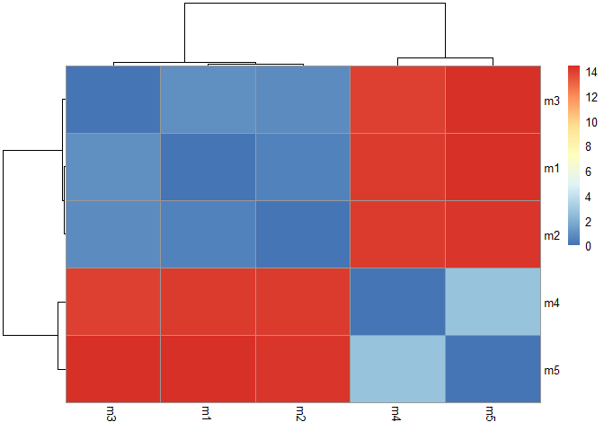
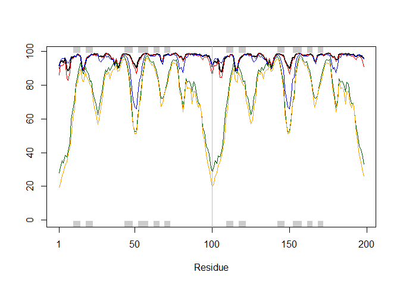
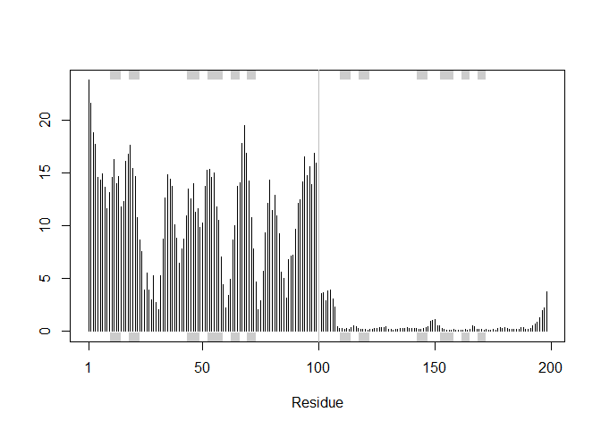

# Class 11: Structural Bioinformatics pt2
Kavi Gonur (PID: A69046927)

## Background

We saw last day that the PDB has 209,886 entries (Oct/Nov 2025).
UniProtKB (i.e. protein sequence database) has 199,579,901 entries.

PDB has 0.1051639% coverage of the main sequence database.

``` r
209886 / 199579901 * 100
```

    [1] 0.1051639

Enter AlphaFold database (AFDB). <https://alphafold.ebi.ac.uk> that
attempts to provide computed models for all sequences in UniProt.

“AlphaFold DB provides open access to over 200 million protein structure
predictions to accelerate scientific research.”

## AlphaFold

AlphaFold has 3 main outputs - the predicted coordinates (PDB files) - a
local quality score called **pLDDT** (one for each amino-acid) - a
second quality score **PAE** Predicted Aligned Error (for each pair of
amino acid)

We can run AlphaFold ourselves if we not happy with AFDB (i.e. no
coverage or poor model).

``` r
results_dir <- "HIVPR_dimer_23119.result/HIVPR_dimer_23119/"
pdb_files <- list.files(path=results_dir,
                        pattern="*.pdb",
                        full.names = TRUE)
basename(pdb_files)
```

    [1] "HIVPR_dimer_23119_unrelaxed_rank_001_alphafold2_multimer_v3_model_4_seed_000.pdb"
    [2] "HIVPR_dimer_23119_unrelaxed_rank_002_alphafold2_multimer_v3_model_1_seed_000.pdb"
    [3] "HIVPR_dimer_23119_unrelaxed_rank_003_alphafold2_multimer_v3_model_5_seed_000.pdb"
    [4] "HIVPR_dimer_23119_unrelaxed_rank_004_alphafold2_multimer_v3_model_2_seed_000.pdb"
    [5] "HIVPR_dimer_23119_unrelaxed_rank_005_alphafold2_multimer_v3_model_3_seed_000.pdb"

``` r
library(bio3d)
pdbs <- pdbaln(pdb_files, fit=TRUE, exefile="msa")
```

    Reading PDB files:
    HIVPR_dimer_23119.result/HIVPR_dimer_23119/HIVPR_dimer_23119_unrelaxed_rank_001_alphafold2_multimer_v3_model_4_seed_000.pdb
    HIVPR_dimer_23119.result/HIVPR_dimer_23119/HIVPR_dimer_23119_unrelaxed_rank_002_alphafold2_multimer_v3_model_1_seed_000.pdb
    HIVPR_dimer_23119.result/HIVPR_dimer_23119/HIVPR_dimer_23119_unrelaxed_rank_003_alphafold2_multimer_v3_model_5_seed_000.pdb
    HIVPR_dimer_23119.result/HIVPR_dimer_23119/HIVPR_dimer_23119_unrelaxed_rank_004_alphafold2_multimer_v3_model_2_seed_000.pdb
    HIVPR_dimer_23119.result/HIVPR_dimer_23119/HIVPR_dimer_23119_unrelaxed_rank_005_alphafold2_multimer_v3_model_3_seed_000.pdb
    .....

    Extracting sequences

    pdb/seq: 1   name: HIVPR_dimer_23119.result/HIVPR_dimer_23119/HIVPR_dimer_23119_unrelaxed_rank_001_alphafold2_multimer_v3_model_4_seed_000.pdb 
    pdb/seq: 2   name: HIVPR_dimer_23119.result/HIVPR_dimer_23119/HIVPR_dimer_23119_unrelaxed_rank_002_alphafold2_multimer_v3_model_1_seed_000.pdb 
    pdb/seq: 3   name: HIVPR_dimer_23119.result/HIVPR_dimer_23119/HIVPR_dimer_23119_unrelaxed_rank_003_alphafold2_multimer_v3_model_5_seed_000.pdb 
    pdb/seq: 4   name: HIVPR_dimer_23119.result/HIVPR_dimer_23119/HIVPR_dimer_23119_unrelaxed_rank_004_alphafold2_multimer_v3_model_2_seed_000.pdb 
    pdb/seq: 5   name: HIVPR_dimer_23119.result/HIVPR_dimer_23119/HIVPR_dimer_23119_unrelaxed_rank_005_alphafold2_multimer_v3_model_3_seed_000.pdb 

``` r
rd <- rmsd(pdbs, fit=T)
```

    Warning in rmsd(pdbs, fit = T): No indices provided, using the 198 non NA positions

``` r
range(rd)
```

    [1]  0.000 14.428

``` r
library(pheatmap)

colnames(rd) <- paste0("m",1:5)
rownames(rd) <- paste0("m",1:5)
pheatmap(rd)
```



``` r
pdb <- read.pdb("1hsg")
```

      Note: Accessing on-line PDB file

``` r
plotb3(pdbs$b[1,], typ="l", lwd=2, sse=pdb)
points(pdbs$b[2,], typ="l", col="red")
points(pdbs$b[3,], typ="l", col="blue")
points(pdbs$b[4,], typ="l", col="darkgreen")
points(pdbs$b[5,], typ="l", col="orange")
abline(v=100, col="gray")
```



``` r
core <- core.find(pdbs)
```

     core size 197 of 198  vol = 8545.079 
     core size 196 of 198  vol = 7894.973 
     core size 195 of 198  vol = 3576.564 
     core size 194 of 198  vol = 1851.077 
     core size 193 of 198  vol = 1697.205 
     core size 192 of 198  vol = 1612.775 
     core size 191 of 198  vol = 1530.208 
     core size 190 of 198  vol = 1447.408 
     core size 189 of 198  vol = 1377.117 
     core size 188 of 198  vol = 1303.826 
     core size 187 of 198  vol = 1239.04 
     core size 186 of 198  vol = 1188.139 
     core size 185 of 198  vol = 1118.473 
     core size 184 of 198  vol = 1071.674 
     core size 183 of 198  vol = 1034.016 
     core size 182 of 198  vol = 980.836 
     core size 181 of 198  vol = 942.246 
     core size 180 of 198  vol = 911.395 
     core size 179 of 198  vol = 879.756 
     core size 178 of 198  vol = 834.466 
     core size 177 of 198  vol = 785.268 
     core size 176 of 198  vol = 762.122 
     core size 175 of 198  vol = 722.029 
     core size 174 of 198  vol = 700.395 
     core size 173 of 198  vol = 677.257 
     core size 172 of 198  vol = 657.81 
     core size 171 of 198  vol = 632.907 
     core size 170 of 198  vol = 614.198 
     core size 169 of 198  vol = 591.516 
     core size 168 of 198  vol = 573.979 
     core size 167 of 198  vol = 552.403 
     core size 166 of 198  vol = 529.489 
     core size 165 of 198  vol = 500.545 
     core size 164 of 198  vol = 482.517 
     core size 163 of 198  vol = 458.426 
     core size 162 of 198  vol = 444.455 
     core size 161 of 198  vol = 433.581 
     core size 160 of 198  vol = 419.086 
     core size 159 of 198  vol = 404.934 
     core size 158 of 198  vol = 393.803 
     core size 157 of 198  vol = 383.003 
     core size 156 of 198  vol = 366.654 
     core size 155 of 198  vol = 352.026 
     core size 154 of 198  vol = 335.663 
     core size 153 of 198  vol = 319.398 
     core size 152 of 198  vol = 307.935 
     core size 151 of 198  vol = 296.818 
     core size 150 of 198  vol = 284.289 
     core size 149 of 198  vol = 273.459 
     core size 148 of 198  vol = 261.978 
     core size 147 of 198  vol = 249.6 
     core size 146 of 198  vol = 237.954 
     core size 145 of 198  vol = 226.1 
     core size 144 of 198  vol = 213.265 
     core size 143 of 198  vol = 200.214 
     core size 142 of 198  vol = 187.504 
     core size 141 of 198  vol = 177.525 
     core size 140 of 198  vol = 167.372 
     core size 139 of 198  vol = 160.875 
     core size 138 of 198  vol = 154.455 
     core size 137 of 198  vol = 148.439 
     core size 136 of 198  vol = 142.13 
     core size 135 of 198  vol = 136.529 
     core size 134 of 198  vol = 130.77 
     core size 133 of 198  vol = 123.868 
     core size 132 of 198  vol = 117.609 
     core size 131 of 198  vol = 112.71 
     core size 130 of 198  vol = 106.361 
     core size 129 of 198  vol = 100.591 
     core size 128 of 198  vol = 95.718 
     core size 127 of 198  vol = 91.068 
     core size 126 of 198  vol = 86.862 
     core size 125 of 198  vol = 82.309 
     core size 124 of 198  vol = 78.554 
     core size 123 of 198  vol = 74.632 
     core size 122 of 198  vol = 70.489 
     core size 121 of 198  vol = 66.802 
     core size 120 of 198  vol = 62.901 
     core size 119 of 198  vol = 59.152 
     core size 118 of 198  vol = 55.75 
     core size 117 of 198  vol = 51.832 
     core size 116 of 198  vol = 48.3 
     core size 115 of 198  vol = 44.927 
     core size 114 of 198  vol = 42.418 
     core size 113 of 198  vol = 39.425 
     core size 112 of 198  vol = 37.381 
     core size 111 of 198  vol = 33.06 
     core size 110 of 198  vol = 28.153 
     core size 109 of 198  vol = 25.33 
     core size 108 of 198  vol = 22.509 
     core size 107 of 198  vol = 20.695 
     core size 106 of 198  vol = 18.754 
     core size 105 of 198  vol = 17.757 
     core size 104 of 198  vol = 16.712 
     core size 103 of 198  vol = 15.44 
     core size 102 of 198  vol = 14.745 
     core size 101 of 198  vol = 14.758 
     core size 100 of 198  vol = 13.11 
     core size 99 of 198  vol = 11.018 
     core size 98 of 198  vol = 8.967 
     core size 97 of 198  vol = 7.643 
     core size 96 of 198  vol = 6.326 
     core size 95 of 198  vol = 5.37 
     core size 94 of 198  vol = 4.312 
     core size 93 of 198  vol = 3.391 
     core size 92 of 198  vol = 2.697 
     core size 91 of 198  vol = 1.911 
     core size 90 of 198  vol = 1.577 
     core size 89 of 198  vol = 1.144 
     core size 88 of 198  vol = 0.826 
     core size 87 of 198  vol = 0.594 
     core size 86 of 198  vol = 0.494 
     FINISHED: Min vol ( 0.5 ) reached

``` r
core.inds <- print(core, vol=0.5)
```

    # 87 positions (cumulative volume <= 0.5 Angstrom^3) 
      start end length
    1     8  50     43
    2    52  95     44

``` r
xyz <- pdbfit(pdbs, core.inds, outpath="corefit_structures")
rf <- rmsf(xyz)

plotb3(rf, sse=pdb)
abline(v=100, col="gray", ylab="RMSF")
```


