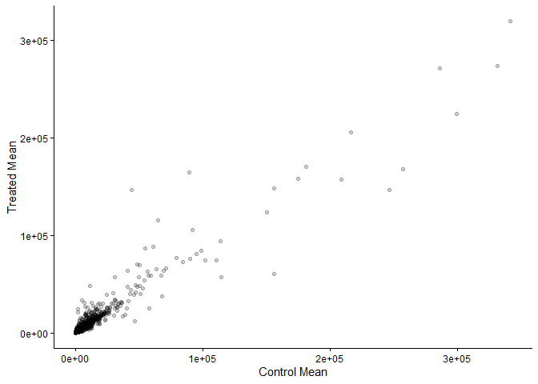
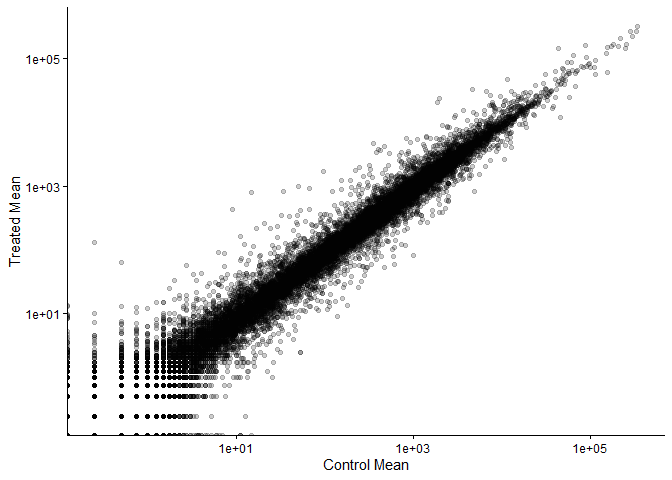
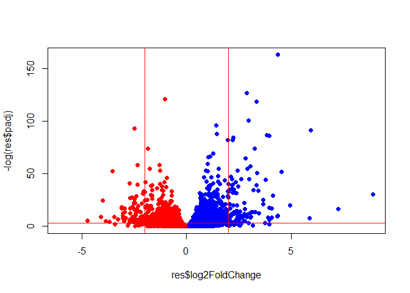
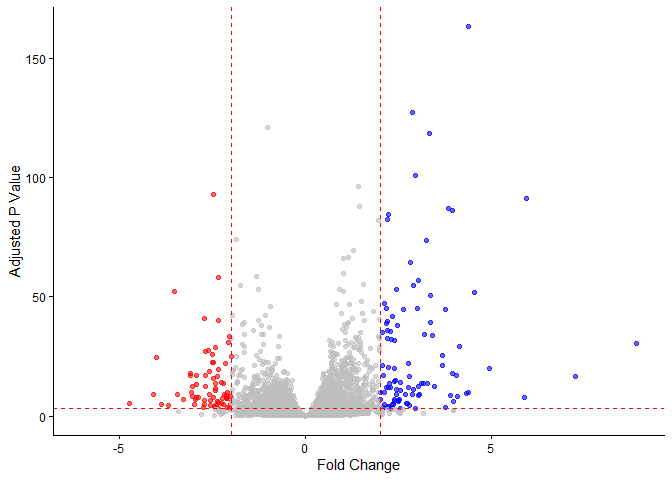

# Class 12
Kavi (PID: )

- [Background](#background)
- [Data Import](#data-import)
- [Toy analysis example](#toy-analysis-example)
- [DESeq Analysis](#deseq-analysis)
- [Volcano Plot](#volcano-plot)
- [Save our results](#save-our-results)
- [Pathway Analysis](#pathway-analysis)
- [Adḍ annotation data](#adḍ-annotation-data)
- [Save my annotated results](#save-my-annotated-results)

## Background

Today we will analyze some RNASeq data from Himes et al. on the
effectṡof a common steroid (dexamethasone, also called “dex”) on ariway
smooth muscle cells (ASMs).

For this analysis we need two main inputs

- `countData`: a table of **counts** per gene (in rows) across
  experiments (in columns)
- `colData`: **metadata** about the design of the experiments. The rows
  here must match the columns in `countData`

## Data Import

``` r
counts <- read.csv("airway_scaledcounts.csv", row.names=1)
metadata <-  read.csv("airway_metadata.csv")
```

``` r
head(counts)
```

                    SRR1039508 SRR1039509 SRR1039512 SRR1039513 SRR1039516
    ENSG00000000003        723        486        904        445       1170
    ENSG00000000005          0          0          0          0          0
    ENSG00000000419        467        523        616        371        582
    ENSG00000000457        347        258        364        237        318
    ENSG00000000460         96         81         73         66        118
    ENSG00000000938          0          0          1          0          2
                    SRR1039517 SRR1039520 SRR1039521
    ENSG00000000003       1097        806        604
    ENSG00000000005          0          0          0
    ENSG00000000419        781        417        509
    ENSG00000000457        447        330        324
    ENSG00000000460         94        102         74
    ENSG00000000938          0          0          0

and the `metadata`:

``` r
metadata
```

              id     dex celltype     geo_id
    1 SRR1039508 control   N61311 GSM1275862
    2 SRR1039509 treated   N61311 GSM1275863
    3 SRR1039512 control  N052611 GSM1275866
    4 SRR1039513 treated  N052611 GSM1275867
    5 SRR1039516 control  N080611 GSM1275870
    6 SRR1039517 treated  N080611 GSM1275871
    7 SRR1039520 control  N061011 GSM1275874
    8 SRR1039521 treated  N061011 GSM1275875

> Q1. How many “genes” are in this dataset?

There are 38694 genes in the dataset.

> Q2. How many experiments (i.e. columns in `counts` or rows in
> `metadata`) are there?

If we use `counts`: 8

If we use `metadata`: 8

> Q3. How many “control” experiments are there in the dataset?

There are 4 “control” experiments.

## Toy analysis example

> Contains answers to Q3 and Q4.

1.  Extract the “control” columns from `counts`.
2.  Calculate the mean value for each gene in these “control” columns.

3-4. Do the same for the “treated” columns. 5. Compare these mean values
for each gene.

Step 1

``` r
control.inds <- metadata$dex == "control"
control.counts <- counts[, control.inds]
head(control.counts)
```

                    SRR1039508 SRR1039512 SRR1039516 SRR1039520
    ENSG00000000003        723        904       1170        806
    ENSG00000000005          0          0          0          0
    ENSG00000000419        467        616        582        417
    ENSG00000000457        347        364        318        330
    ENSG00000000460         96         73        118        102
    ENSG00000000938          0          1          2          0

Step 2

``` r
control.mean <- rowMeans(control.counts)
```

Steps 3-4

``` r
treated.inds <- metadata$dex == "treated"
treated.counts <- counts[, treated.inds]
head(treated.counts)
```

                    SRR1039509 SRR1039513 SRR1039517 SRR1039521
    ENSG00000000003        486        445       1097        604
    ENSG00000000005          0          0          0          0
    ENSG00000000419        523        371        781        509
    ENSG00000000457        258        237        447        324
    ENSG00000000460         81         66         94         74
    ENSG00000000938          0          0          0          0

``` r
treated.mean <- rowMeans(treated.counts)
```

For ease of book-keeping we can store these together in one data frame
called `meancounts`

``` r
meancounts <- data.frame(control.mean,treated.mean)
head(meancounts)
```

                    control.mean treated.mean
    ENSG00000000003       900.75       658.00
    ENSG00000000005         0.00         0.00
    ENSG00000000419       520.50       546.00
    ENSG00000000457       339.75       316.50
    ENSG00000000460        97.25        78.75
    ENSG00000000938         0.75         0.00

Step 5 \> These are answers to Q5 a and b.

``` r
plot(control.mean, treated.mean)
```


``` r
library(ggplot2)
ggplot(meancounts) +
  aes(x=control.mean,y=treated.mean) +
  labs(x="Control Mean", y="Treated Mean") +
  geom_point(alpha=0.2) +
  theme_classic()
```



> This is the answer to Q6.

``` r
plot(control.mean, treated.mean,log="xy")
```

    Warning in xy.coords(x, y, xlabel, ylabel, log): 15032 x values <= 0 omitted
    from logarithmic plot

    Warning in xy.coords(x, y, xlabel, ylabel, log): 15281 y values <= 0 omitted
    from logarithmic plot


``` r
ggplot(meancounts) +
  aes(x=control.mean,y=treated.mean) +
  labs(x="Control Mean", y="Treated Mean") +
  geom_point(alpha=0.2) +
  scale_x_log10() +
  scale_y_log10() +
  theme_classic() 
```

    Warning in scale_x_log10(): log-10 transformation introduced infinite values.

    Warning in scale_y_log10(): log-10 transformation introduced infinite values.



We use “fold-change” as a way to compare

``` r
log2(10/10)
```

    [1] 0

``` r
log2(20/10)
```

    [1] 1

``` r
log2(10/20)
```

    [1] -1

``` r
log2(40/10)
```

    [1] 2

``` r
meancounts$log2fc <- log2(meancounts$treated.mean/meancounts$control.mean)
head(meancounts)
```

                    control.mean treated.mean      log2fc
    ENSG00000000003       900.75       658.00 -0.45303916
    ENSG00000000005         0.00         0.00         NaN
    ENSG00000000419       520.50       546.00  0.06900279
    ENSG00000000457       339.75       316.50 -0.10226805
    ENSG00000000460        97.25        78.75 -0.30441833
    ENSG00000000938         0.75         0.00        -Inf

``` r
zero.vals <- which(meancounts[,1:2]==0, arr.ind=TRUE)

to.rm <- unique(zero.vals[,1])
mycounts <- meancounts[-to.rm,]
head(mycounts)
```

                    control.mean treated.mean      log2fc
    ENSG00000000003       900.75       658.00 -0.45303916
    ENSG00000000419       520.50       546.00  0.06900279
    ENSG00000000457       339.75       316.50 -0.10226805
    ENSG00000000460        97.25        78.75 -0.30441833
    ENSG00000000971      5219.00      6687.50  0.35769358
    ENSG00000001036      2327.00      1785.75 -0.38194109

A common “rule of thumb” threshold for calling something “up” regulated
is a log2-fold-change of +2 or greater. For “down” regulated, a
log2-fold-change of -2 or lower.

> Q8 How many genes are “up” regulated at the +2 log2FC threshold?

``` r
nonzero.inds <- rowSums(counts) != 0
mycounts <- meancounts[nonzero.inds,]
sum(mycounts$log2fc >= 2)
```

    [1] 1910

``` r
sum(meancounts$log2fc >= 2, na.rm = T)
```

    [1] 1910

``` r
zero.inds <- which(meancounts[,1:2]==0,arr.ind=T)[,1]
mygenes <- meancounts[-zero.inds,]
sum(mygenes$log2fc >= 2)
```

    [1] 314

> How many genes are “down” regulated (at the -2 log2FC threshold)?

``` r
nonzero.inds <- rowSums(counts) != 0
mycounts <- meancounts[nonzero.inds,]
sum(mycounts$log2fc <= -2)
```

    [1] 2330

``` r
sum(meancounts$log2fc <= -2, na.rm = T)
```

    [1] 2330

``` r
zero.inds <- which(meancounts[,1:2]==0,arr.ind=T)[,1]
mygenes <- meancounts[-zero.inds,]
sum(mygenes$log2fc <= -2)
```

    [1] 485

## DESeq Analysis

Let’s do this with DESeq2 and put some stats behind these numbers

``` r
library(DESeq2)
```

    Warning: package 'matrixStats' was built under R version 4.5.2

DESeq wants 3 things for analysis, countData, colData, and design.

``` r
dds <- DESeqDataSetFromMatrix(countData =counts,
                       colData = metadata,
                       design = ~dex)
```

    converting counts to integer mode

    Warning in DESeqDataSet(se, design = design, ignoreRank): some variables in
    design formula are characters, converting to factors

The main function in the DESeq package to run analysis is called
`DESeq()`.

``` r
dds <- DESeq(dds)
```

    estimating size factors

    estimating dispersions

    gene-wise dispersion estimates

    mean-dispersion relationship

    final dispersion estimates

    fitting model and testing

Get the results out of this DESeq object with the function `results()`.

``` r
res <- results(dds)
head(res)
```

    log2 fold change (MLE): dex treated vs control 
    Wald test p-value: dex treated vs control 
    DataFrame with 6 rows and 6 columns
                      baseMean log2FoldChange     lfcSE      stat    pvalue
                     <numeric>      <numeric> <numeric> <numeric> <numeric>
    ENSG00000000003 747.194195     -0.3507030  0.168246 -2.084470 0.0371175
    ENSG00000000005   0.000000             NA        NA        NA        NA
    ENSG00000000419 520.134160      0.2061078  0.101059  2.039475 0.0414026
    ENSG00000000457 322.664844      0.0245269  0.145145  0.168982 0.8658106
    ENSG00000000460  87.682625     -0.1471420  0.257007 -0.572521 0.5669691
    ENSG00000000938   0.319167     -1.7322890  3.493601 -0.495846 0.6200029
                         padj
                    <numeric>
    ENSG00000000003  0.163035
    ENSG00000000005        NA
    ENSG00000000419  0.176032
    ENSG00000000457  0.961694
    ENSG00000000460  0.815849
    ENSG00000000938        NA

## Volcano Plot

This is a plot of log2FC vs adjusted p-value

``` r
colors <- ifelse(res$log2FoldChange > 0, "blue", "red")
plot(res$log2FoldChange, -log(res$padj), col = colors, pch = 16)
abline(v = c(-2, 2), col = "red")
abline(h = -log(0.05), col = "red")
```



``` r
mycols <- rep("gray", nrow(res))               # Start with gray for all
mycols[res$log2FoldChange >= 2] <- "blue"     # Positive large fold changes blue
mycols[res$log2FoldChange <= -2] <- "red"     # Negative large fold changes red
mycols[res$padj >= 0.05] <- "gray"            # Non-significant grey regardless


ggplot(res) +
  aes(x = log2FoldChange, y = -log(padj)) +
  geom_point(color = mycols, alpha = 0.6) +
  theme_classic() +
  geom_vline(xintercept = c(-2, 2), color = "red", linetype = "dashed") +
  geom_hline(yintercept = -log(0.05), color = "red", linetype = "dashed") +
  labs(x = "Fold Change", y = "Adjusted P Value")
```

    Warning: Removed 23549 rows containing missing values or values outside the scale range
    (`geom_point()`).



## Save our results

``` r
write.csv(res,file="BGGN213_Class12Results.csv")
```

## Pathway Analysis

``` r
library(pathview)
```

    ##############################################################################
    Pathview is an open source software package distributed under GNU General
    Public License version 3 (GPLv3). Details of GPLv3 is available at
    http://www.gnu.org/licenses/gpl-3.0.html. Particullary, users are required to
    formally cite the original Pathview paper (not just mention it) in publications
    or products. For details, do citation("pathview") within R.

    The pathview downloads and uses KEGG data. Non-academic uses may require a KEGG
    license agreement (details at http://www.kegg.jp/kegg/legal.html).
    ##############################################################################

``` r
library(gage)
```

``` r
library(gageData)

data(kegg.sets.hs)

# Examine the first 2 pathways in this kegg set for humans
head(kegg.sets.hs, 2)
```

    $`hsa00232 Caffeine metabolism`
    [1] "10"   "1544" "1548" "1549" "1553" "7498" "9"   

    $`hsa00983 Drug metabolism - other enzymes`
     [1] "10"     "1066"   "10720"  "10941"  "151531" "1548"   "1549"   "1551"  
     [9] "1553"   "1576"   "1577"   "1806"   "1807"   "1890"   "221223" "2990"  
    [17] "3251"   "3614"   "3615"   "3704"   "51733"  "54490"  "54575"  "54576" 
    [25] "54577"  "54578"  "54579"  "54600"  "54657"  "54658"  "54659"  "54963" 
    [33] "574537" "64816"  "7083"   "7084"   "7172"   "7363"   "7364"   "7365"  
    [41] "7366"   "7367"   "7371"   "7372"   "7378"   "7498"   "79799"  "83549" 
    [49] "8824"   "8833"   "9"      "978"   

``` r
foldchanges = res$log2FoldChange
names(foldchanges) = res$entrez
head(foldchanges)
```

    [1] -0.35070302          NA  0.20610777  0.02452695 -0.14714205 -1.73228897

``` r
# Get the results
keggres = gage(foldchanges, gsets=kegg.sets.hs)

attributes(keggres)
```

    $names
    [1] "greater" "less"    "stats"  

``` r
# Look at the first three down (less) pathways
head(keggres$less, 3)
```

                                             p.geomean stat.mean p.val q.val
    hsa00232 Caffeine metabolism                    NA       NaN    NA    NA
    hsa00983 Drug metabolism - other enzymes        NA       NaN    NA    NA
    hsa01100 Metabolic pathways                     NA       NaN    NA    NA
                                             set.size exp1
    hsa00232 Caffeine metabolism                    0   NA
    hsa00983 Drug metabolism - other enzymes        0   NA
    hsa01100 Metabolic pathways                     0   NA

``` r
pathview(gene.data=foldchanges, pathway.id="hsa05310")
```

    Warning: None of the genes or compounds mapped to the pathway!
    Argument gene.idtype or cpd.idtype may be wrong.

    'select()' returned 1:1 mapping between keys and columns

    Info: Working in directory C:/Users/kavan/Desktop/bggn213_f25_github/Class 12

    Info: Writing image file hsa05310.pathview.png

 We will use the **gage** function from
Bioconductor.

What **gage** wants as an inpiy is a simple named vector of importance
(i.e. a vector with labeled fold changes)

``` r
library(gage)
library(gageData)
foldchanges <- res$log2FoldChange
names(foldchanges) <- res$entrezid
head(foldchanges)
```

    [1] -0.35070302          NA  0.20610777  0.02452695 -0.14714205 -1.73228897

``` r
data(kegg.sets.hs)
keggres = gage(foldchanges, gsets=kegg.sets.hs)
```

``` r
head(keggres$less,5)
```

                                             p.geomean stat.mean p.val q.val
    hsa00232 Caffeine metabolism                    NA       NaN    NA    NA
    hsa00983 Drug metabolism - other enzymes        NA       NaN    NA    NA
    hsa01100 Metabolic pathways                     NA       NaN    NA    NA
    hsa00230 Purine metabolism                      NA       NaN    NA    NA
    hsa05340 Primary immunodeficiency               NA       NaN    NA    NA
                                             set.size exp1
    hsa00232 Caffeine metabolism                    0   NA
    hsa00983 Drug metabolism - other enzymes        0   NA
    hsa01100 Metabolic pathways                     0   NA
    hsa00230 Purine metabolism                      0   NA
    hsa05340 Primary immunodeficiency               0   NA

Let’s take a look at just one of these hsa05310

``` r
library(pathview)
pathview(gene.data=foldchanges, pathway.id="hsa05310")
```

    Warning: None of the genes or compounds mapped to the pathway!
    Argument gene.idtype or cpd.idtype may be wrong.

    'select()' returned 1:1 mapping between keys and columns

    Info: Working in directory C:/Users/kavan/Desktop/bggn213_f25_github/Class 12

    Info: Writing image file hsa05310.pathview.png


## Adḍ annotation data

We need to add gene symbols, gene names, and other database ids to make
my results useful for future analyses.

``` r
head(res)
```

    log2 fold change (MLE): dex treated vs control 
    Wald test p-value: dex treated vs control 
    DataFrame with 6 rows and 6 columns
                      baseMean log2FoldChange     lfcSE      stat    pvalue
                     <numeric>      <numeric> <numeric> <numeric> <numeric>
    ENSG00000000003 747.194195     -0.3507030  0.168246 -2.084470 0.0371175
    ENSG00000000005   0.000000             NA        NA        NA        NA
    ENSG00000000419 520.134160      0.2061078  0.101059  2.039475 0.0414026
    ENSG00000000457 322.664844      0.0245269  0.145145  0.168982 0.8658106
    ENSG00000000460  87.682625     -0.1471420  0.257007 -0.572521 0.5669691
    ENSG00000000938   0.319167     -1.7322890  3.493601 -0.495846 0.6200029
                         padj
                    <numeric>
    ENSG00000000003  0.163035
    ENSG00000000005        NA
    ENSG00000000419  0.176032
    ENSG00000000457  0.961694
    ENSG00000000460  0.815849
    ENSG00000000938        NA

We have ENSEMBLE database IDs in our `res` object

``` r
head(rownames(res))
```

    [1] "ENSG00000000003" "ENSG00000000005" "ENSG00000000419" "ENSG00000000457"
    [5] "ENSG00000000460" "ENSG00000000938"

We can use the `mapIDs()` function from Bioconductor to help us:

``` r
library("AnnotationDbi")
library("org.Hs.eg.db")
```

Let’s see what database ID formats we can translate into

``` r
columns(org.Hs.eg.db)
```

     [1] "ACCNUM"       "ALIAS"        "ENSEMBL"      "ENSEMBLPROT"  "ENSEMBLTRANS"
     [6] "ENTREZID"     "ENZYME"       "EVIDENCE"     "EVIDENCEALL"  "GENENAME"    
    [11] "GENETYPE"     "GO"           "GOALL"        "IPI"          "MAP"         
    [16] "OMIM"         "ONTOLOGY"     "ONTOLOGYALL"  "PATH"         "PFAM"        
    [21] "PMID"         "PROSITE"      "REFSEQ"       "SYMBOL"       "UCSCKG"      
    [26] "UNIPROT"     

``` r
res$symbol <- mapIds(org.Hs.eg.db,
                     keys=row.names(res), # Our genenames
                     keytype="ENSEMBL",        # The format of our genenames
                     column="SYMBOL",          # The new format we want to add
                     multiVals="first")
```

    'select()' returned 1:many mapping between keys and columns

``` r
head(res$symbol)
```

    ENSG00000000003 ENSG00000000005 ENSG00000000419 ENSG00000000457 ENSG00000000460 
           "TSPAN6"          "TNMD"          "DPM1"         "SCYL3"         "FIRRM" 
    ENSG00000000938 
              "FGR" 

Add `GENENAME` then `ENTREZID`

``` r
res$genename <- mapIds(org.Hs.eg.db,
                     keys=row.names(res), # Our genenames
                     keytype="ENSEMBL",        # The format of our genenames
                     column="GENENAME",          # The new format we want to add
                     multiVals="first")
```

    'select()' returned 1:many mapping between keys and columns

``` r
res$entrezid <- mapIds(org.Hs.eg.db,
                     keys=row.names(res), # Our genenames
                     keytype="ENSEMBL",        # The format of our genenames
                     column="ENTREZID",          # The new format we want to add
                     multiVals="first")
```

    'select()' returned 1:many mapping between keys and columns

``` r
head(res)
```

    log2 fold change (MLE): dex treated vs control 
    Wald test p-value: dex treated vs control 
    DataFrame with 6 rows and 9 columns
                      baseMean log2FoldChange     lfcSE      stat    pvalue
                     <numeric>      <numeric> <numeric> <numeric> <numeric>
    ENSG00000000003 747.194195     -0.3507030  0.168246 -2.084470 0.0371175
    ENSG00000000005   0.000000             NA        NA        NA        NA
    ENSG00000000419 520.134160      0.2061078  0.101059  2.039475 0.0414026
    ENSG00000000457 322.664844      0.0245269  0.145145  0.168982 0.8658106
    ENSG00000000460  87.682625     -0.1471420  0.257007 -0.572521 0.5669691
    ENSG00000000938   0.319167     -1.7322890  3.493601 -0.495846 0.6200029
                         padj      symbol               genename    entrezid
                    <numeric> <character>            <character> <character>
    ENSG00000000003  0.163035      TSPAN6          tetraspanin 6        7105
    ENSG00000000005        NA        TNMD            tenomodulin       64102
    ENSG00000000419  0.176032        DPM1 dolichyl-phosphate m..        8813
    ENSG00000000457  0.961694       SCYL3 SCY1 like pseudokina..       57147
    ENSG00000000460  0.815849       FIRRM FIGNL1 interacting r..       55732
    ENSG00000000938        NA         FGR FGR proto-oncogene, ..        2268

## Save my annotated results

``` r
write.csv(res,file="myresults_annotated.csv")
```
