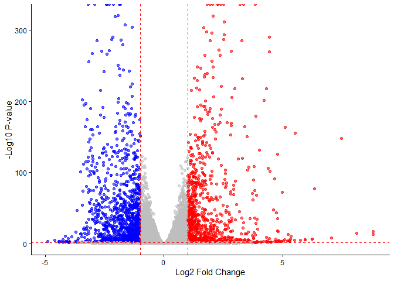

# Class 13
Kavi (PID: A69046927)

- [Background](#background)
- [Data Import](#data-import)
- [Setup for DESeq](#setup-for-deseq)
- [Run DESeq](#run-deseq)
- [Get results](#get-results)
- [Add annotation](#add-annotation)
- [Visualize results](#visualize-results)
- [Pathway analysis](#pathway-analysis)
  - [Reactome](#reactome)
- [Save results](#save-results)

## Background

The data for for hands-on session comes from GEO entry: GSE37704, which
is associated with the following publication:

Trapnell C, Hendrickson DG, Sauvageau M, Goff L et al. “Differential
analysis of gene regulation at transcript resolution with RNA-seq”. Nat
Biotechnol 2013 Jan;31(1):46-53. PMID: 23222703 The authors report on
differential analysis of lung fibroblasts in response to loss of the
developmental transcription factor HOXA1. Their results and others
indicate that HOXA1 is required for lung fibroblast and HeLa cell cycle
progression. In particular their analysis show that “loss of HOXA1
results in significant expression level changes in thousands of
individual transcripts, along with isoform switching events in key
regulators of the cell cycle”. For our session we have used their
Sailfish gene-level estimated counts and hence are restricted to
protein-coding genes only.

## Data Import

``` r
library(DESeq2)
```

    Warning: package 'matrixStats' was built under R version 4.5.2

``` r
metaFile <- "GSE37704_metadata.csv"
countFile <- "GSE37704_featurecounts.csv"
metadata = read.csv(metaFile, row.names=1)
head(metadata)
```

                  condition
    SRR493366 control_sirna
    SRR493367 control_sirna
    SRR493368 control_sirna
    SRR493369      hoxa1_kd
    SRR493370      hoxa1_kd
    SRR493371      hoxa1_kd

``` r
counts = read.csv(countFile, row.names=1)
head(counts)
```

                    length SRR493366 SRR493367 SRR493368 SRR493369 SRR493370
    ENSG00000186092    918         0         0         0         0         0
    ENSG00000279928    718         0         0         0         0         0
    ENSG00000279457   1982        23        28        29        29        28
    ENSG00000278566    939         0         0         0         0         0
    ENSG00000273547    939         0         0         0         0         0
    ENSG00000187634   3214       124       123       205       207       212
                    SRR493371
    ENSG00000186092         0
    ENSG00000279928         0
    ENSG00000279457        46
    ENSG00000278566         0
    ENSG00000273547         0
    ENSG00000187634       258

Check correspondence of `metadata` and `counts` (i.e. that the columns
in `counts` match the rows in the `metadata`)

``` r
metadata
```

                  condition
    SRR493366 control_sirna
    SRR493367 control_sirna
    SRR493368 control_sirna
    SRR493369      hoxa1_kd
    SRR493370      hoxa1_kd
    SRR493371      hoxa1_kd

``` r
head(counts)
```

                    length SRR493366 SRR493367 SRR493368 SRR493369 SRR493370
    ENSG00000186092    918         0         0         0         0         0
    ENSG00000279928    718         0         0         0         0         0
    ENSG00000279457   1982        23        28        29        29        28
    ENSG00000278566    939         0         0         0         0         0
    ENSG00000273547    939         0         0         0         0         0
    ENSG00000187634   3214       124       123       205       207       212
                    SRR493371
    ENSG00000186092         0
    ENSG00000279928         0
    ENSG00000279457        46
    ENSG00000278566         0
    ENSG00000273547         0
    ENSG00000187634       258

> Q1. Complete the code below to remove the troublesome first column
> from countData

Fix to remove that first “length” colmn of `counts`.

``` r
counts <- counts[,-1]
```

``` r
tot.counts <- rowSums(counts)
head(tot.counts)
```

    ENSG00000186092 ENSG00000279928 ENSG00000279457 ENSG00000278566 ENSG00000273547 
                  0               0             183               0               0 
    ENSG00000187634 
               1129 

Let;s remove all zero count genes

``` r
zero.inds <- tot.counts == 0
head(zero.inds)
```

    ENSG00000186092 ENSG00000279928 ENSG00000279457 ENSG00000278566 ENSG00000273547 
               TRUE            TRUE           FALSE            TRUE            TRUE 
    ENSG00000187634 
              FALSE 

> Q2. Complete the code below to filter countData to exclude genes
> (i.e. rows) where we have 0 read count across all samples
> (i.e. columns).

``` r
head(counts[!zero.inds,])
```

                    SRR493366 SRR493367 SRR493368 SRR493369 SRR493370 SRR493371
    ENSG00000279457        23        28        29        29        28        46
    ENSG00000187634       124       123       205       207       212       258
    ENSG00000188976      1637      1831      2383      1226      1326      1504
    ENSG00000187961       120       153       180       236       255       357
    ENSG00000187583        24        48        65        44        48        64
    ENSG00000187642         4         9        16        14        16        16

``` r
colnames(counts)
```

    [1] "SRR493366" "SRR493367" "SRR493368" "SRR493369" "SRR493370" "SRR493371"

``` r
test_cols <- all(colnames(counts)[-1] == metadata$id)
```

``` r
if(test_cols) {
  message("Wow... there is a problem with the metadata counts setup")
}
```

    Wow... there is a problem with the metadata counts setup

## Setup for DESeq

``` r
library(DESeq2)
```

``` r
dds <- DESeqDataSetFromMatrix(countData = counts,
                              colData = metadata,
                              design = ~condition)
```

    Warning in DESeqDataSet(se, design = design, ignoreRank): some variables in
    design formula are characters, converting to factors

## Run DESeq

``` r
dds <- DESeq(dds)
```

    estimating size factors

    estimating dispersions

    gene-wise dispersion estimates

    mean-dispersion relationship

    final dispersion estimates

    fitting model and testing

## Get results

> Q3. Call the summary() function on your results to get a sense of how
> many genes are up or down-regulated at the default 0.1 p-value cutoff.

``` r
res <- results(dds)
summary(res)
```


    out of 15975 with nonzero total read count
    adjusted p-value < 0.1
    LFC > 0 (up)       : 4349, 27%
    LFC < 0 (down)     : 4393, 27%
    outliers [1]       : 0, 0%
    low counts [2]     : 1221, 7.6%
    (mean count < 0)
    [1] see 'cooksCutoff' argument of ?results
    [2] see 'independentFiltering' argument of ?results

``` r
head(res)
```

    log2 fold change (MLE): condition hoxa1 kd vs control sirna 
    Wald test p-value: condition hoxa1 kd vs control sirna 
    DataFrame with 6 rows and 6 columns
                     baseMean log2FoldChange     lfcSE      stat     pvalue
                    <numeric>      <numeric> <numeric> <numeric>  <numeric>
    ENSG00000186092    0.0000             NA        NA        NA         NA
    ENSG00000279928    0.0000             NA        NA        NA         NA
    ENSG00000279457   29.9136       0.179257  0.324822  0.551863 0.58104205
    ENSG00000278566    0.0000             NA        NA        NA         NA
    ENSG00000273547    0.0000             NA        NA        NA         NA
    ENSG00000187634  183.2296       0.426457  0.140266  3.040350 0.00236304
                          padj
                     <numeric>
    ENSG00000186092         NA
    ENSG00000279928         NA
    ENSG00000279457 0.68707978
    ENSG00000278566         NA
    ENSG00000273547         NA
    ENSG00000187634 0.00516278

## Add annotation

> Q. Use the mapIDs() function multiple times to add SYMBOL, ENTREZID
> and GENENAME annotation to our results by completing the code below.

``` r
library("AnnotationDbi")
library("org.Hs.eg.db")
```

``` r
res$symbol <- mapIds(org.Hs.eg.db,
                     keys=row.names(res), # Our genenames
                     keytype="ENSEMBL",        # The format of our genenames
                     column="SYMBOL",          # The new format we want to add
                     multiVals="first")
```

    'select()' returned 1:many mapping between keys and columns

``` r
res$genename <- mapIds(org.Hs.eg.db,
                     keys=row.names(res), # Our genenames
                     keytype="ENSEMBL",        # The format of our genenames
                     column="GENENAME",          # The new format we want to add
                     multiVals="first")
```

    'select()' returned 1:many mapping between keys and columns

``` r
res$entrezid <- mapIds(org.Hs.eg.db,
                     keys=row.names(res), # Our genenames
                     keytype="ENSEMBL",        # The format of our genenames
                     column="ENTREZID",          # The new format we want to add
                     multiVals="first")
```

    'select()' returned 1:many mapping between keys and columns

``` r
head(res)
```

    log2 fold change (MLE): condition hoxa1 kd vs control sirna 
    Wald test p-value: condition hoxa1 kd vs control sirna 
    DataFrame with 6 rows and 9 columns
                     baseMean log2FoldChange     lfcSE      stat     pvalue
                    <numeric>      <numeric> <numeric> <numeric>  <numeric>
    ENSG00000186092    0.0000             NA        NA        NA         NA
    ENSG00000279928    0.0000             NA        NA        NA         NA
    ENSG00000279457   29.9136       0.179257  0.324822  0.551863 0.58104205
    ENSG00000278566    0.0000             NA        NA        NA         NA
    ENSG00000273547    0.0000             NA        NA        NA         NA
    ENSG00000187634  183.2296       0.426457  0.140266  3.040350 0.00236304
                          padj      symbol               genename    entrezid
                     <numeric> <character>            <character> <character>
    ENSG00000186092         NA       OR4F5 olfactory receptor f..       79501
    ENSG00000279928         NA          NA                     NA          NA
    ENSG00000279457 0.68707978          NA                     NA          NA
    ENSG00000278566         NA          NA                     NA          NA
    ENSG00000273547         NA          NA                     NA          NA
    ENSG00000187634 0.00516278      SAMD11 sterile alpha motif ..      148398

## Visualize results

> Q4. Improve this plot by completing the below code, which adds color
> and axis labels

``` r
my_cols <- rep("gray", nrow(res))
my_cols[which(res$padj < 0.05 & res$log2FoldChange > 1)] <- "red"
my_cols[which(res$padj < 0.05 & res$log2FoldChange < -1)] <- "blue"
```

``` r
library(ggplot2)
library(ggrepel)

ggplot(res, aes(x = log2FoldChange, y = -log10(pvalue))) +
  geom_point(col = my_cols, alpha = 0.6) +
  theme_classic() +
  geom_vline(xintercept = c(-1, 1), linetype = "dashed", color = "red") +
  geom_hline(yintercept = -log10(0.05), linetype = "dashed", color = "red") + 
  labs(x = "Log2 Fold Change", y = "-Log10 P-value")
```

    Warning: Removed 3833 rows containing missing values or values outside the scale range
    (`geom_point()`).



``` r
  # Only label significant hits:
  geom_text_repel(
    data = subset(res, padj < 0.05 & abs(log2FoldChange) > 1),
    aes(label = genename),
    size = 3
  )
```

    mapping: label = ~genename 
    geom_text_repel: parse = FALSE, na.rm = FALSE, box.padding = 0.25, point.padding = 1e-06, min.segment.length = 0.5, arrow = NULL, force = 1, force_pull = 1, max.time = 0.5, max.iter = 10000, max.overlaps = 10, nudge_x = 0, nudge_y = 0, xlim = c(NA, NA), ylim = c(NA, NA), direction = both, seed = NA, verbose = FALSE
    stat_identity: na.rm = FALSE
    position_identity 

## Pathway analysis

``` r
library(gage)
```

``` r
library(gageData)
foldchanges <- res$log2FoldChange
names(foldchanges) <- res$entrezid
head(foldchanges)
```

        79501      <NA>      <NA>      <NA>      <NA>    148398 
           NA        NA 0.1792571        NA        NA 0.4264571 

``` r
data(kegg.sets.hs)
keggres = gage(foldchanges, gsets=kegg.sets.hs)
```

> Q5. Can you do the same procedure as above to plot the pathview
> figures for the top 5 down-reguled pathways?

``` r
head(keggres$less,5)
```

                                                      p.geomean stat.mean
    hsa04110 Cell cycle                            7.077982e-06 -4.432593
    hsa03030 DNA replication                       9.424076e-05 -3.951803
    hsa05130 Pathogenic Escherichia coli infection 1.076420e-04 -3.835716
    hsa03013 RNA transport                         1.048017e-03 -3.112129
    hsa04114 Oocyte meiosis                        2.563806e-03 -2.827297
                                                          p.val       q.val
    hsa04110 Cell cycle                            7.077982e-06 0.001507610
    hsa03030 DNA replication                       9.424076e-05 0.007642585
    hsa05130 Pathogenic Escherichia coli infection 1.076420e-04 0.007642585
    hsa03013 RNA transport                         1.048017e-03 0.055806908
    hsa04114 Oocyte meiosis                        2.563806e-03 0.108869849
                                                   set.size         exp1
    hsa04110 Cell cycle                                 124 7.077982e-06
    hsa03030 DNA replication                             36 9.424076e-05
    hsa05130 Pathogenic Escherichia coli infection       55 1.076420e-04
    hsa03013 RNA transport                              149 1.048017e-03
    hsa04114 Oocyte meiosis                             112 2.563806e-03

``` r
library(pathview)
```

    ##############################################################################
    Pathview is an open source software package distributed under GNU General
    Public License version 3 (GPLv3). Details of GPLv3 is available at
    http://www.gnu.org/licenses/gpl-3.0.html. Particullary, users are required to
    formally cite the original Pathview paper (not just mention it) in publications
    or products. For details, do citation("pathview") within R.

    The pathview downloads and uses KEGG data. Non-academic uses may require a KEGG
    license agreement (details at http://www.kegg.jp/kegg/legal.html).
    ##############################################################################

``` r
pathview(gene.data=foldchanges, pathway.id="hsa04110")
```

    'select()' returned 1:1 mapping between keys and columns

    Info: Working in directory C:/Users/kavan/Desktop/bggn213_f25_github/Class 13

    Info: Writing image file hsa04110.pathview.png

 \### GO Analysis

Let’s try GO analysis and compare to KEGG analysis

``` r
data(go.sets.hs)
data(go.subs.hs)

gobpsets = go.sets.hs[go.subs.hs$BP]
gobpres = gage(foldchanges, gsets=gobpsets)
head(gobpres$less, 5)
```

                                                p.geomean stat.mean        p.val
    GO:0048285 organelle fission             6.386337e-16 -8.175381 6.386337e-16
    GO:0000280 nuclear division              1.726380e-15 -8.056666 1.726380e-15
    GO:0007067 mitosis                       1.726380e-15 -8.056666 1.726380e-15
    GO:0000087 M phase of mitotic cell cycle 4.593581e-15 -7.919909 4.593581e-15
    GO:0007059 chromosome segregation        9.576332e-12 -6.994852 9.576332e-12
                                                    q.val set.size         exp1
    GO:0048285 organelle fission             2.515911e-12      386 6.386337e-16
    GO:0000280 nuclear division              2.515911e-12      362 1.726380e-15
    GO:0007067 mitosis                       2.515911e-12      362 1.726380e-15
    GO:0000087 M phase of mitotic cell cycle 5.020784e-12      373 4.593581e-15
    GO:0007059 chromosome segregation        8.373545e-09      146 9.576332e-12

### Reactome

Some folks really like Reactome online (i.e. their webpage viewer)
rather than the R package of the same name (available from
Bioconductor).

To use the website viewer we want to upload our set of gene symbols for
the genes we want to focus on.

``` r
sig_genes <- res$symbol[which(res$padj < 0.05 & !is.na(res$padj))]

write.table(sig_genes, file="significant_genes.txt",
            row.names=FALSE, col.names=FALSE, quote=FALSE)
```

> Q6. What pathway has the most significant “Entities p-value”? Do the
> most significant pathways listed match your previous KEGG results?
> What factors could cause differences between the two methods?

“Organelle fission” has the most significant value, where it was cell
cycle before. Differences between KEGG and Reactome pathway analysis
results can arise from variations in pathway definitions, gene set
composition, statistical methods, and biological context considered by
each database.

## Save results

``` r
write.csv(as.data.frame(res), file="DESeq2_results_annotated.csv")
save(res, counts, metadata, file="DESeq2_results_annotated.RData")
```
