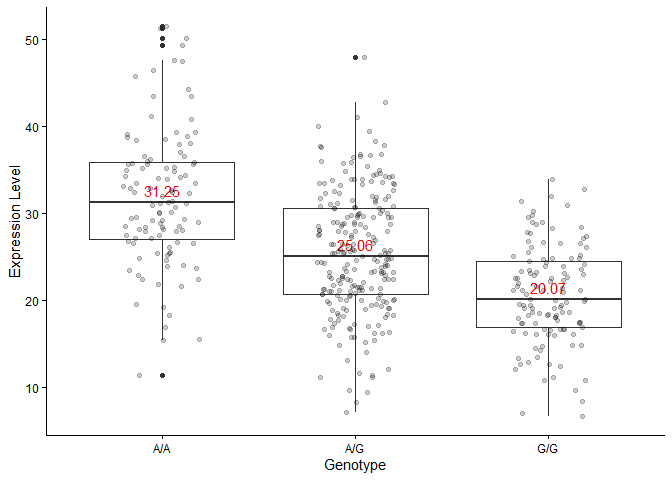

# Class 17
Kavi (PID: A69046927)

## ENSEMBL/OMIM Calculations

``` r
library(dplyr)
```


    Attaching package: 'dplyr'

    The following objects are masked from 'package:stats':

        filter, lag

    The following objects are masked from 'package:base':

        intersect, setdiff, setequal, union

``` r
read.csv("MXL_genotypes.csv") -> MXL_genotypes
table(MXL_genotypes)
```

    , , Population.s. = ALL, AMR, MXL, Father = -, Mother = -

                                Genotype..forward.strand.
    Sample..Male.Female.Unknown. A|A A|G G|A G|G
                     NA19648 (F)   1   0   0   0
                     NA19649 (M)   0   0   0   1
                     NA19651 (F)   1   0   0   0
                     NA19652 (M)   0   0   0   1
                     NA19654 (F)   0   0   0   1
                     NA19655 (M)   0   1   0   0
                     NA19657 (F)   0   1   0   0
                     NA19658 (M)   1   0   0   0
                     NA19661 (M)   0   1   0   0
                     NA19663 (F)   1   0   0   0
                     NA19664 (M)   0   0   1   0
                     NA19669 (F)   1   0   0   0
                     NA19670 (M)   1   0   0   0
                     NA19676 (M)   0   0   0   1
                     NA19678 (F)   1   0   0   0
                     NA19679 (M)   0   1   0   0
                     NA19681 (F)   0   1   0   0
                     NA19682 (M)   0   1   0   0
                     NA19684 (F)   0   1   0   0
                     NA19716 (F)   0   0   1   0
                     NA19717 (M)   0   1   0   0
                     NA19719 (F)   0   0   0   1
                     NA19720 (M)   0   0   0   1
                     NA19722 (F)   0   0   1   0
                     NA19723 (M)   0   0   0   1
                     NA19725 (F)   0   1   0   0
                     NA19726 (M)   1   0   0   0
                     NA19728 (F)   1   0   0   0
                     NA19729 (M)   0   1   0   0
                     NA19731 (F)   1   0   0   0
                     NA19732 (M)   0   1   0   0
                     NA19734 (F)   0   0   1   0
                     NA19735 (M)   0   0   0   1
                     NA19740 (F)   1   0   0   0
                     NA19741 (M)   1   0   0   0
                     NA19746 (F)   1   0   0   0
                     NA19747 (M)   0   0   1   0
                     NA19749 (F)   0   1   0   0
                     NA19750 (M)   0   1   0   0
                     NA19752 (F)   0   1   0   0
                     NA19755 (F)   1   0   0   0
                     NA19756 (M)   0   0   1   0
                     NA19758 (F)   0   1   0   0
                     NA19759 (M)   0   0   1   0
                     NA19761 (F)   0   0   1   0
                     NA19762 (M)   1   0   0   0
                     NA19764 (F)   1   0   0   0
                     NA19770 (F)   0   1   0   0
                     NA19771 (M)   1   0   0   0
                     NA19773 (F)   1   0   0   0
                     NA19774 (M)   0   1   0   0
                     NA19776 (F)   0   1   0   0
                     NA19777 (M)   1   0   0   0
                     NA19779 (F)   0   0   1   0
                     NA19780 (M)   1   0   0   0
                     NA19782 (F)   0   0   1   0
                     NA19783 (M)   0   1   0   0
                     NA19785 (F)   1   0   0   0
                     NA19786 (M)   0   0   1   0
                     NA19788 (F)   0   1   0   0
                     NA19789 (M)   0   0   0   1
                     NA19792 (M)   1   0   0   0
                     NA19794 (F)   0   0   1   0
                     NA19795 (M)   0   1   0   0

``` r
sum(MXL_genotypes$Genotype..forward.strand.=="G|G") -> homoz_numb
all_numb = count(MXL_genotypes)
homoz_prop <- (homoz_numb/all_numb) * 100
homoz_prop
```

            n
    1 14.0625

## DESeq Analysis

``` r
genereads <- read.table("genereads.txt", header=TRUE, row.names=1)

summary(genereads)
```

        sample              geno                exp        
     Length:462         Length:462         Min.   : 6.675  
     Class :character   Class :character   1st Qu.:20.004  
     Mode  :character   Mode  :character   Median :25.116  
                                           Mean   :25.640  
                                           3rd Qu.:30.779  
                                           Max.   :51.518  

``` r
aa <- sum(genereads$geno == "A/A")
ag <- sum(genereads$geno == "A/G")
gg <- sum(genereads$geno == "G/G")
```

> Q13 Sample Size

There are `108` individuals with A/A genotype, `233` individuals with
A/G genotype, and `121` individuals with G/G genotype.

Median expression provided in boxplot for Q14.

> Q14 Box Plot

``` r
library(ggplot2)
ggplot(genereads) +
  aes(x=geno,y=exp) +
  theme_classic() +
  geom_boxplot() +
   stat_summary(
    fun = median,
    geom = "text",
    aes(label = round(..y.., 2)),
    vjust = -0.5,
    color = "red"
  ) +
  labs(x="Genotype", y="Expression Level") +
  geom_jitter(alpha=0.2, width = 0.2)
```

    Warning: The dot-dot notation (`..y..`) was deprecated in ggplot2 3.4.0.
    ℹ Please use `after_stat(y)` instead.



> Response to Q14

From the boxplot, I can infer that the more copies there are of the SNP
allele variant, the lower the expression of ORMDL3. The allele inhibits
proper expression of ORMDL3.
