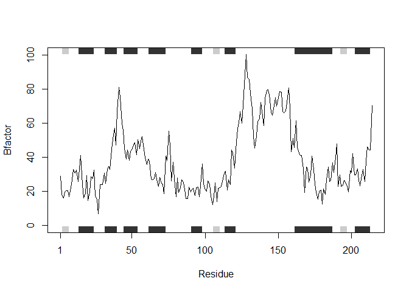
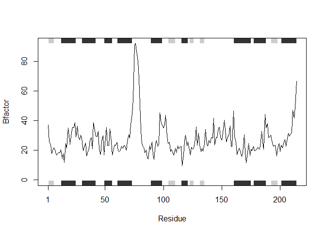
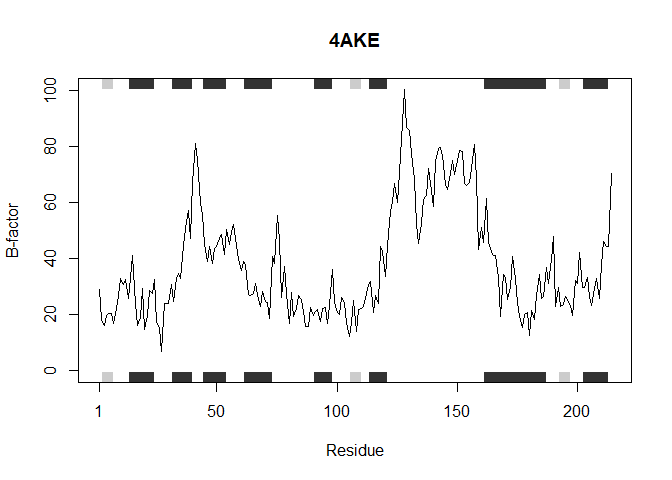
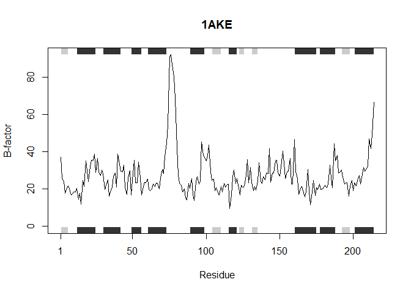
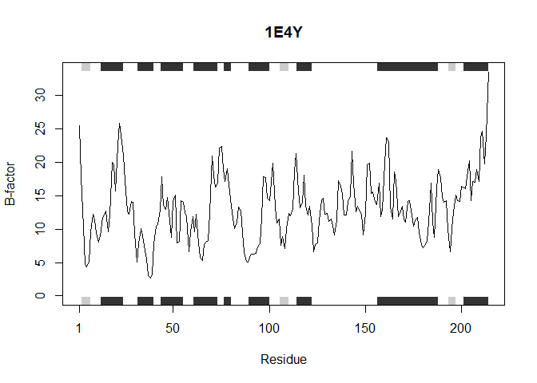
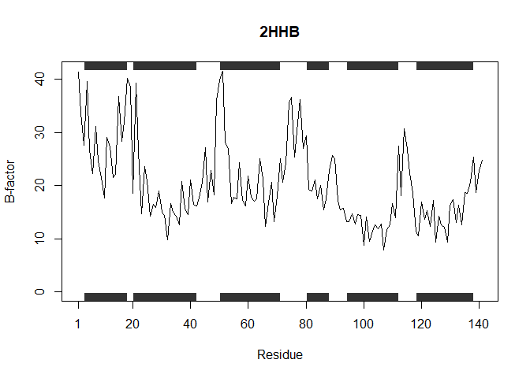
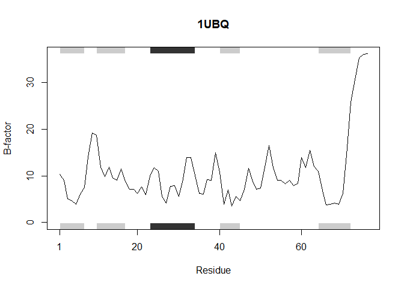
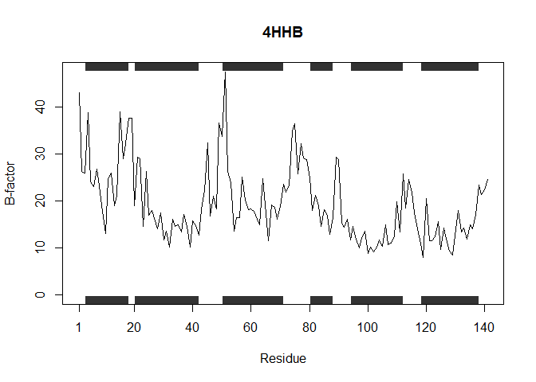

# Week 5 Homework
Kavi (PID: A69046927)

- [Section 1: Improving analysis code by writing
  functions](#section-1-improving-analysis-code-by-writing-functions)
  - [A. Improve this regular R code by abstracting the main activities
    in your own new function. Note, we will go through this example
    together in the formal lecture. The main steps should entail running
    through the code to see if it works, simplifying to a core working
    code snippet, reducing any calculation duplication, and finally
    transferring your new streamlined code into a more useful function
    for
    you.](#a-improve-this-regular-r-code-by-abstracting-the-main-activities-in-your-own-new-function-note-we-will-go-through-this-example-together-in-the-formal-lecture-the-main-steps-should-entail-running-through-the-code-to-see-if-it-works-simplifying-to-a-core-working-code-snippet-reducing-any-calculation-duplication-and-finally-transferring-your-new-streamlined-code-into-a-more-useful-function-for-you)
  - [B. Next improve the below example code for the analysis of protein
    drug interactions by abstracting the main activities in your own new
    function. Then answer questions 1 to 6 below. It is recommended that
    you start a new Project in RStudio in a new directory and then
    install the bio3d package noted in the R code below (N.B. you can
    use the command install.packages(“bio3d”) or the RStudio interface
    to do this). Then run through the code to see if it works, fix any
    copy/paste errors before simplifying to a core working code snippet,
    reducing any calculation duplication, and finally transferring it
    into a more useful function for
    you.](#b-next-improve-the-below-example-code-for-the-analysis-of-protein-drug-interactions-by-abstracting-the-main-activities-in-your-own-new-function-then-answer-questions-1-to-6-below-it-is-recommended-that-you-start-a-new-project-in-rstudio-in-a-new-directory-and-then-install-the-bio3d-package-noted-in-the-r-code-below-nb-you-can-use-the-command-installpackagesbio3d-or-the-rstudio-interface-to-do-this-then-run-through-the-code-to-see-if-it-works-fix-any-copypaste-errors-before-simplifying-to-a-core-working-code-snippet-reducing-any-calculation-duplication-and-finally-transferring-it-into-a-more-useful-function-for-you)

## Section 1: Improving analysis code by writing functions

### A. Improve this regular R code by abstracting the main activities in your own new function. Note, we will go through this example together in the formal lecture. The main steps should entail running through the code to see if it works, simplifying to a core working code snippet, reducing any calculation duplication, and finally transferring your new streamlined code into a more useful function for you.

``` r
# A. Can you improve this analysis code?
df <- data.frame(a=1:10, b=seq(200,400,length=10),c=11:20,d=NA)
df$a <- (df$a - min(df$a)) / (max(df$a) - min(df$a))
df$b <- (df$b - min(df$a)) / (max(df$b) - min(df$b))
df$c <- (df$c - min(df$c)) / (max(df$c) - min(df$c))
df$d <- (df$d - min(df$d)) / (max(df$a) - min(df$d)) 
```

``` r
# A. Improved analysis code:
df <- data.frame(a=1:10, b=seq(200,400,length=10),c=11:20,d=NA)

df$a <- (df$a - min(df$a)) / (max(df$a) - min(df$a))
df$b <- (df$b - min(df$a)) / (max(df$b) - min(df$b))
df$c <- (df$c - min(df$c)) / (max(df$c) - min(df$c))
df$d <- (df$d - min(df$d)) / (max(df$a) - min(df$d))
```

### B. Next improve the below example code for the analysis of protein drug interactions by abstracting the main activities in your own new function. Then answer questions 1 to 6 below. It is recommended that you start a new Project in RStudio in a new directory and then install the bio3d package noted in the R code below (N.B. you can use the command install.packages(“bio3d”) or the RStudio interface to do this). Then run through the code to see if it works, fix any copy/paste errors before simplifying to a core working code snippet, reducing any calculation duplication, and finally transferring it into a more useful function for you.

#### Original

``` r
# Can you improve this analysis code?
library(bio3d)
s1 <- read.pdb("4AKE") # kinase with drug
```

      Note: Accessing on-line PDB file

``` r
s2 <- read.pdb("1AKE") # kinase no drug
```

      Note: Accessing on-line PDB file
       PDB has ALT records, taking A only, rm.alt=TRUE

``` r
s3 <- read.pdb("1E4Y") # kinase with drug
```

      Note: Accessing on-line PDB file

``` r
s1.chainA <- trim.pdb(s1, chain="A", elety="CA")
s2.chainA <- trim.pdb(s2, chain="A", elety="CA")
s3.chainA <- trim.pdb(s3, chain="A", elety="CA")

s1.b <- s1.chainA$atom$b
s2.b <- s2.chainA$atom$b
s3.b <- s3.chainA$atom$b

plotb3(s1.b, sse=s1.chainA, typ="l", ylab="Bfactor")
```



``` r
plotb3(s2.b, sse=s2.chainA, typ="l", ylab="Bfactor")
```



``` r
plotb3(s3.b, sse=s3.chainA, typ="l", ylab="Bfactor")
```


#### My Version

``` r
generate.plot <- function(x) {
  # Applies the function to each PDB code provided in vector 'x'
  lapply(x, function(pdb_code) {

    # Reads the structure data from the Protein Data Bank using the given code
    sP <- read.pdb(pdb_code)

    # Extracts only chain A and selects alpha-carbon (CA) atoms
    # This simplifies the structure for plotting B-factors per residue
    s.chainA <- trim.pdb(sP, chain = "A", elety = "CA")

    # Retrieves the B-factor (temperature factor) values for all CA atoms
    sP.b <- s.chainA$atom$b

    # Creates a line plot of B-factor values along the sequence
    # 'sse = s.chainA' adds secondary structure information for shading
    # 'typ = "l"' makes it a line plot, and 'ylab' labels the y-axis. 'main' labels each plot with their PDB code.
    finalplot <- plotb3(sP.b, sse = s.chainA, typ = "l", ylab = "B-factor", main = pdb_code)

    # Returns the plot for individual PDB entries
    return(finalplot)
  })
}
```

``` r
# Runs the function for three PDB entries: 4AKE, 1AKE, and 1E4Y
generate.plot(c("4AKE", "1AKE", "1E4Y"))
```

      Note: Accessing on-line PDB file

    Warning in get.pdb(file, path = tempdir(), verbose = FALSE):
    C:\Users\kavan\AppData\Local\Temp\RtmpUvLw0c/4AKE.pdb exists. Skipping download



      Note: Accessing on-line PDB file

    Warning in get.pdb(file, path = tempdir(), verbose = FALSE):
    C:\Users\kavan\AppData\Local\Temp\RtmpUvLw0c/1AKE.pdb exists. Skipping download

       PDB has ALT records, taking A only, rm.alt=TRUE



      Note: Accessing on-line PDB file

    Warning in get.pdb(file, path = tempdir(), verbose = FALSE):
    C:\Users\kavan\AppData\Local\Temp\RtmpUvLw0c/1E4Y.pdb exists. Skipping download



    [[1]]
    NULL

    [[2]]
    NULL

    [[3]]
    NULL

``` r
# Picked 3 random sequences, generated for those too
generate.plot(c("2HHB", "1UBQ", "4HHB"))
```

      Note: Accessing on-line PDB file



      Note: Accessing on-line PDB file



      Note: Accessing on-line PDB file



    [[1]]
    NULL

    [[2]]
    NULL

    [[3]]
    NULL
