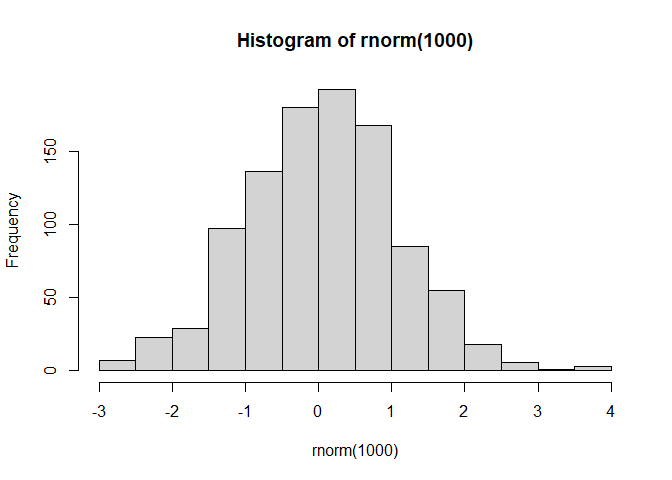
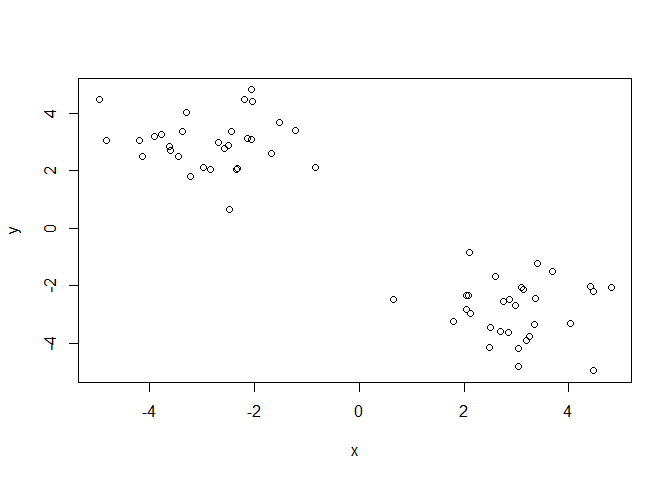
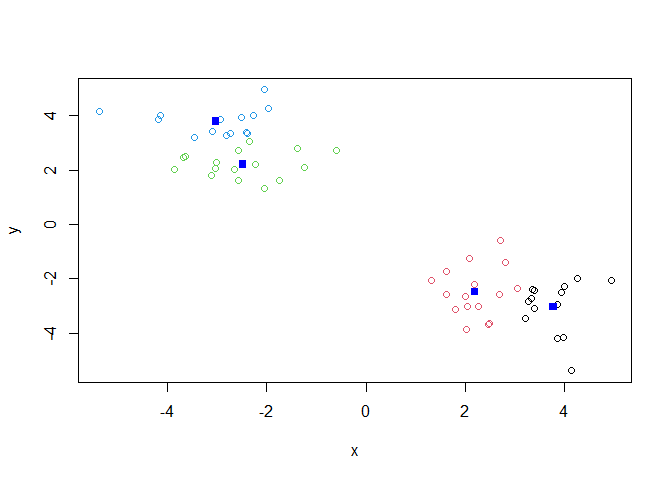
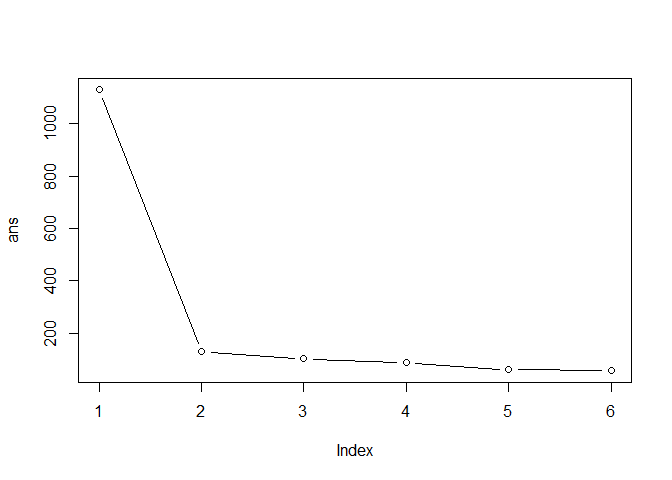
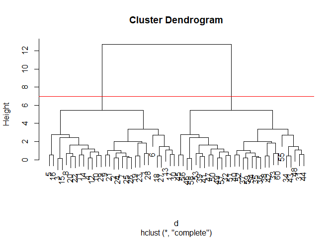
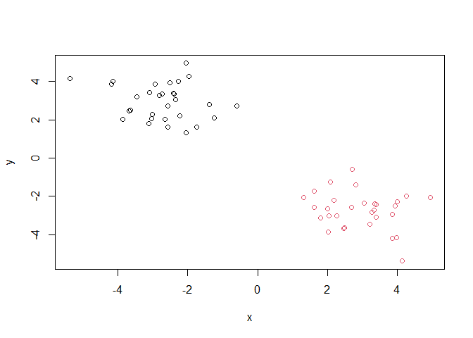
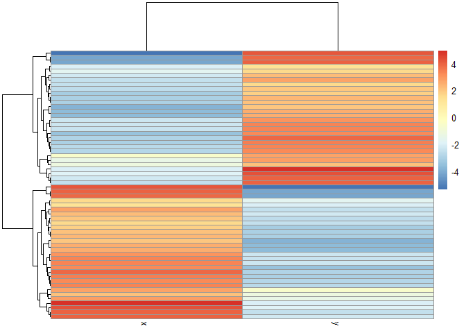
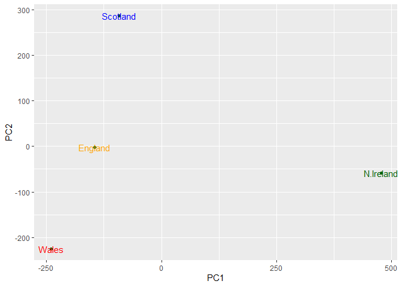
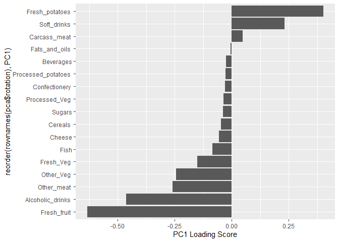

# Class 7
Kavi (PID: A69046927)

- [Hierarchical Clustering](#hierarchical-clustering)
- [Principal Component Analysis
  (PCA)](#principal-component-analysis-pca)
- [PCA to the rescue](#pca-to-the-rescue)
- [Plot PC1 vs PC2](#plot-pc1-vs-pc2)

Today, we will begin our exploration of some “classical” machine
learning approaches. We will start with clustering:

Let’s first male∈up some data cluster where we know what the answer
should be:

``` r
hist(rnorm(1000))
```



``` r
x <- c(rnorm(30,mean=-3),rnorm(30,mean=3))
y <- rev(x)

x <- cbind(x,y)
```

A wee peak at x with `plot()`

``` r
plot(x)
```



The main function in “base” R for K-means clustering is called
`kmeans()`.

``` r
k <- kmeans(x,centers=4)
k
```

    K-means clustering with 4 clusters of sizes 14, 16, 16, 14

    Cluster means:
              x         y
    1  3.785856 -3.028809
    2  2.204012 -2.487247
    3 -2.487247  2.204012
    4 -3.028809  3.785856

    Clustering vector:
     [1] 4 3 4 3 3 4 3 4 3 3 4 4 4 4 3 4 3 4 3 4 3 3 3 3 4 3 4 3 4 3 2 1 2 1 2 1 2 2
    [39] 2 2 1 2 1 2 1 2 1 1 1 1 2 2 1 2 1 2 2 1 2 1

    Within cluster sum of squares by cluster:
    [1] 15.29709 16.40294 16.40294 15.29709
     (between_SS / total_SS =  94.1 %)

    Available components:

    [1] "cluster"      "centers"      "totss"        "withinss"     "tot.withinss"
    [6] "betweenss"    "size"         "iter"         "ifault"      

> Q. How big are the clusters (i.e. their size)?

``` r
k$size
```

    [1] 14 16 16 14

> Q. What clusters do my data points reside in?

``` r
k$cluster
```

     [1] 4 3 4 3 3 4 3 4 3 3 4 4 4 4 3 4 3 4 3 4 3 3 3 3 4 3 4 3 4 3 2 1 2 1 2 1 2 2
    [39] 2 2 1 2 1 2 1 2 1 1 1 1 2 2 1 2 1 2 2 1 2 1

> Q. Make a plot of our data colored by cluster alignment - i.e. make a
> result figure…

``` r
plot(x, col=k$cluster)
points(k$centers,col="blue",pch=15)
```



> Q. Run kmeans with center (i.e. values of k) equal 1 to 6

``` r
k1 <- kmeans(x,centers=1)$tot.withiness
k2 <- kmeans(x,centers=2)$tot.withiness
k3 <- kmeans(x,centers=3)$tot.withiness
k4 <- kmeans(x,centers=4)$tot.withiness
k5 <- kmeans(x,centers=5)$tot.withiness
k6 <- kmeans(x,centers=6)$tot.withiness

ans <- c(k1,k2,k3,k4,k5,k6)
```

Or use a for loop:

``` r
ans <- NULL
for(i in 1:6) {
  ans <- c(ans,kmeans(x,centers=i)$tot.withinss)
}
ans
```

    [1] 1073.76219  105.14653   84.27330   63.70085   65.53319   51.55767

``` r
plot(ans,typ="b")
```



## Hierarchical Clustering

The main function in “base” R for this is called `hclust()`.

``` r
d <- dist(x)
hc <- hclust(d)
hc
```


    Call:
    hclust(d = d)

    Cluster method   : complete 
    Distance         : euclidean 
    Number of objects: 60 

``` r
plot(hc)
abline(h=7,col="red")
```



To obtain clusters from our `hclust` output result object **hc** we
“cut” the tree to yield different sub branches. For this, we use the
`cutree()` function.

``` r
grps <- cutree(hc,h=7)
grps
```

     [1] 1 1 1 1 1 1 1 1 1 1 1 1 1 1 1 1 1 1 1 1 1 1 1 1 1 1 1 1 1 1 2 2 2 2 2 2 2 2
    [39] 2 2 2 2 2 2 2 2 2 2 2 2 2 2 2 2 2 2 2 2 2 2

``` r
plot(x,col=grps)
```



``` r
library(pheatmap)

pheatmap(x)
```



## Principal Component Analysis (PCA)

``` r
UKfoods <- read.csv("https://tinyurl.com/UK-foods")
```

Q1. How many rows and columns are in your new data frame named x? What R
functions could you use to answer this questions?

``` r
dim(UKfoods)
```

    [1] 17  5

``` r
head(UKfoods)
```

                   X England Wales Scotland N.Ireland
    1         Cheese     105   103      103        66
    2  Carcass_meat      245   227      242       267
    3    Other_meat      685   803      750       586
    4           Fish     147   160      122        93
    5 Fats_and_oils      193   235      184       209
    6         Sugars     156   175      147       139

``` r
# Note how the minus indexing works
rownames(UKfoods) <- UKfoods[,1]
UKfoods <- UKfoods[,-1]
head(UKfoods)
```

                   England Wales Scotland N.Ireland
    Cheese             105   103      103        66
    Carcass_meat       245   227      242       267
    Other_meat         685   803      750       586
    Fish               147   160      122        93
    Fats_and_oils      193   235      184       209
    Sugars             156   175      147       139

``` r
UKfoods <- read.csv("https://tinyurl.com/UK-foods", row.names=1)
head(UKfoods)
```

                   England Wales Scotland N.Ireland
    Cheese             105   103      103        66
    Carcass_meat       245   227      242       267
    Other_meat         685   803      750       586
    Fish               147   160      122        93
    Fats_and_oils      193   235      184       209
    Sugars             156   175      147       139

Q2. Which approach to solving the ‘row-names problem’ mentioned above do
you prefer and why? Is one approach more robust than another under
certain circumstances?

The second one

``` r
barplot(as.matrix(UKfoods), beside=T, col=rainbow(nrow(UKfoods)))
```


Q3: Changing what optional argument in the above barplot() function
results in the following plot?

``` r
barplot(as.matrix(UKfoods), beside=F, col=rainbow(nrow(UKfoods)))
```


``` r
library(ggplot2)
library(tidyr)
library(tibble)
UKfoods_long <- UKfoods |> 
          tibble::rownames_to_column("Food") |> 
          pivot_longer(cols = -Food, 
                       names_to = "Country", 
                       values_to = "Consumption")
head(UKfoods_long)
```

    # A tibble: 6 × 3
      Food            Country   Consumption
      <chr>           <chr>           <int>
    1 "Cheese"        England           105
    2 "Cheese"        Wales             103
    3 "Cheese"        Scotland          103
    4 "Cheese"        N.Ireland          66
    5 "Carcass_meat " England           245
    6 "Carcass_meat " Wales             227

``` r
dim(UKfoods_long)
```

    [1] 68  3

``` r
ggplot(UKfoods_long) +
  aes(x = Country, y = Consumption, fill = Food) +
  geom_col(position = "dodge") +
  theme_bw()
```


Q4: Changing what optional argument in the above ggplot() code results
in a stacked barplot figure?

``` r
head(UKfoods_long)
```

    # A tibble: 6 × 3
      Food            Country   Consumption
      <chr>           <chr>           <int>
    1 "Cheese"        England           105
    2 "Cheese"        Wales             103
    3 "Cheese"        Scotland          103
    4 "Cheese"        N.Ireland          66
    5 "Carcass_meat " England           245
    6 "Carcass_meat " Wales             227

``` r
dim(UKfoods_long)
```

    [1] 68  3

``` r
ggplot(UKfoods_long) +
  aes(x = Country, y = Consumption, fill = Food) +
  geom_col(position = "stack") +
  theme_bw()
```


Q5: Generating all pairwise plots may help somewhat. Can you make sense
of the following code and resulting figure? What does it mean if a given
point lies on the diagonal for a given plot?

``` r
pairs(UKfoods, col=rainbow(10), pch=16)
```


``` r
library(pheatmap)
pheatmap(UKfoods)
```


Q6. What is the main differences between N. Ireland and the other
countries of the UK in terms of this data-set?

North Ireland eats more potatoes and less other meat than other
countries.

## PCA to the rescue

The main function in “base” R for PCA is called `prcomp()`.

As we want to do PCA on the food data for the different countries we
will want the foods in the columns.

``` r
# Use the prcomp() PCA function
pca <- prcomp( t(UKfoods) )
summary(pca)
```

    Importance of components:
                                PC1      PC2      PC3       PC4
    Standard deviation     324.1502 212.7478 73.87622 3.176e-14
    Proportion of Variance   0.6744   0.2905  0.03503 0.000e+00
    Cumulative Proportion    0.6744   0.9650  1.00000 1.000e+00

Our result object is called `pca` and it has a `$x` component that we
will look at first.

``` r
pca$x
```

                     PC1         PC2        PC3           PC4
    England   -144.99315   -2.532999 105.768945 -4.894696e-14
    Wales     -240.52915 -224.646925 -56.475555  5.700024e-13
    Scotland   -91.86934  286.081786 -44.415495 -7.460785e-13
    N.Ireland  477.39164  -58.901862  -4.877895  2.321303e-13

Q7. Complete the code below to generate a plot of PC1 vs PC2. The second
line adds text labels over the data points. Q8. Customize your plot so
that the colors of the country names match the colors in our UK and
Ireland map and table at start of this document.

``` r
library(ggplot2)

cols <- c("orange", "red", "blue", "darkgreen")
ggplot(pca$x) +
  aes(x = PC1, y = PC2, label = rownames(pca$x)) +
  geom_point(color = "darkgreen") +
  geom_text(color=cols)
```



Another major result out of PCA is the so-called “variable loadings” or
`$rotation` that tells us how the original variables (foods) contribute
to PCs (the new axis)

``` r
pca$rotation
```

                                 PC1          PC2         PC3          PC4
    Cheese              -0.056955380  0.016012850  0.02394295 -0.694538519
    Carcass_meat         0.047927628  0.013915823  0.06367111  0.489884628
    Other_meat          -0.258916658 -0.015331138 -0.55384854  0.279023718
    Fish                -0.084414983 -0.050754947  0.03906481 -0.008483145
    Fats_and_oils       -0.005193623 -0.095388656 -0.12522257  0.076097502
    Sugars              -0.037620983 -0.043021699 -0.03605745  0.034101334
    Fresh_potatoes       0.401402060 -0.715017078 -0.20668248 -0.090972715
    Fresh_Veg           -0.151849942 -0.144900268  0.21382237 -0.039901917
    Other_Veg           -0.243593729 -0.225450923 -0.05332841  0.016719075
    Processed_potatoes  -0.026886233  0.042850761 -0.07364902  0.030125166
    Processed_Veg       -0.036488269 -0.045451802  0.05289191 -0.013969507
    Fresh_fruit         -0.632640898 -0.177740743  0.40012865  0.184072217
    Cereals             -0.047702858 -0.212599678 -0.35884921  0.191926714
    Beverages           -0.026187756 -0.030560542 -0.04135860  0.004831876
    Soft_drinks          0.232244140  0.555124311 -0.16942648  0.103508492
    Alcoholic_drinks    -0.463968168  0.113536523 -0.49858320 -0.316290619
    Confectionery       -0.029650201  0.005949921 -0.05232164  0.001847469

``` r
ggplot(pca$rotation) +
  aes(PC1,reorder(rownames(pca$rotation),PC1)) +
  geom_col() +
  xlab("PC1 Loading Score")
```



Q7. Complete the code below to generate a plot of PC1 vs PC2. The second
line adds text labels over the data points.

# Plot PC1 vs PC2

``` r
plot(pca$x[,1], pca$x[,2], xlab = "PC1", ylab = "PC2", xlim = c(-270, 500))
text(pca$x[,1], pca$x[,2], colnames(UKfoods))
```


