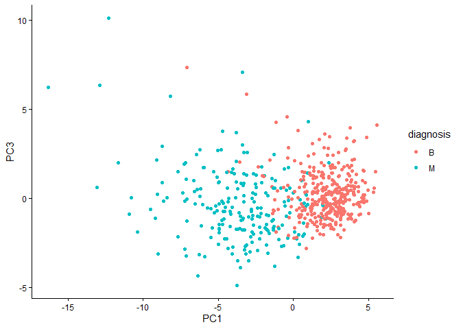
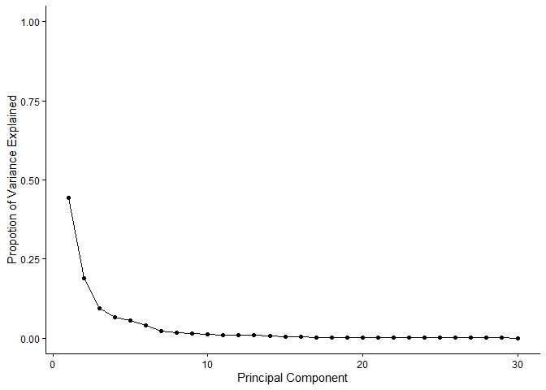
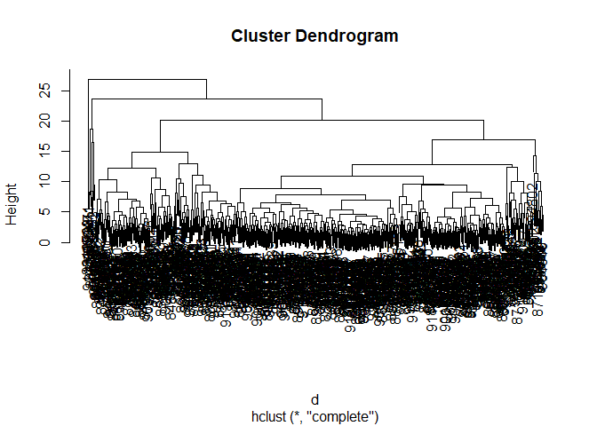
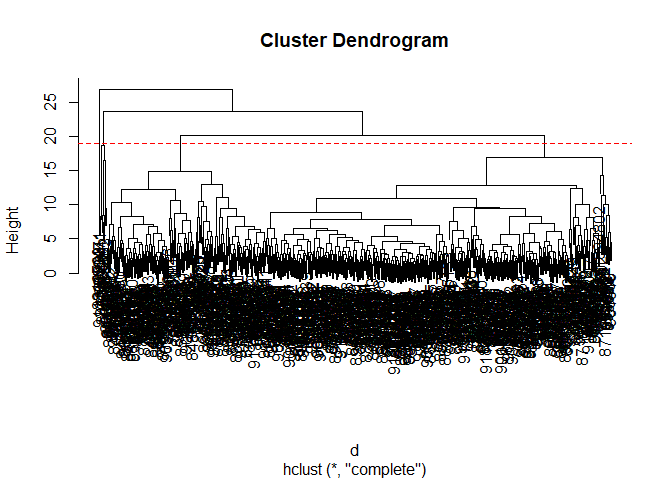
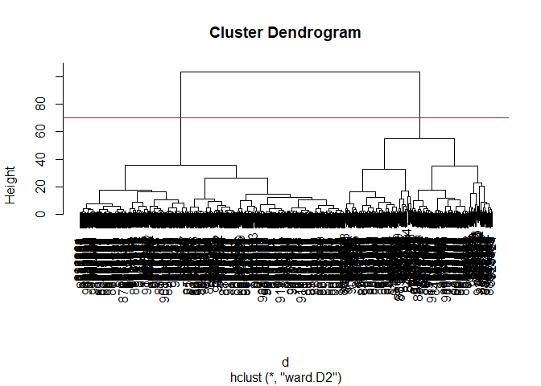
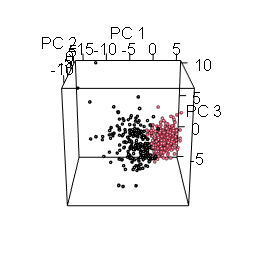

# Class 8: Breast Cancer Analysis Project
Kavi Gonur (PID: A69046927)

- [Background](#background)
- [Data Report](#data-report)
- [Performing PCA](#performing-pca)
- [Interpreting PCA Results](#interpreting-pca-results)
- [Variance Explained](#variance-explained)
- [Hierarchical Clustering](#hierarchical-clustering)
- [Combining PCA and clustering](#combining-pca-and-clustering)

## Background

The goal of today’s mini-project is for you to explore a complete
analysis using the unsupervised learning techniques covered in class.
You’ll extend what you’ve learned by combining PCA as a preprocessing
step to clustering using data that consist of measurements of cell
nuclei of human breast masses. This expands on our RNA-Seq analysis from
last day.

The data itself comes from the Wisconsin Breast Cancer Diagnostic Data
Set first reported by K. P. Benne and O. L. Mangasarian: “Robust Linear
Programming Discrimination of Two Linearly Inseparable Sets”.

Values in this data set describe characteristics of the cell nuclei
present in digitized images of a fine needle aspiration (FNA) of a
breast mass.

## Data Report

``` r
fna.data <- read.csv("WisconsinCancer.csv")
wisc.df <-data.frame(fna.data, row.names=1)
```

Note that the first column here wisc.df\$diagnosis is a pathologist
provided expert diagnosis. We will not be using this for our
unsupervised analysis as it is essentially the “answer” to the question
which cell samples are malignant or benign.

To make sure we don’t accidentally include this in our analysis, lets
create a new data.frame that omits this first column

``` r
# We can use -1 here to remove the first column
wisc.data <- wisc.df[,-1]
```

Finally, setup a separate new vector called diagnosis that contains the
data from the diagnosis column of the original dataset. We will store
this as a factor (useful for plotting) and use this later to check our
results.

``` r
# Create diagnosis vector for later 
diagnosis <- factor(wisc.df$diagnosis)
```

> Q1. How many observations are in this dataset?

There are 569 observations in this dataset.

> Q2. How many of the observations have a malignant diagnosis?

There are 212 malignant diagnoses.

> Q3. How many variables/features in the data are suffixed with \_mean?

There are 10 variables/features suffixed with `_mean`.

## Performing PCA

The main function in base R for PCA is called `prcomp()`. An optional
argument `scale` should nearly always be set to `scale=TRUE` for this
function.

``` r
wisc.pr <- prcomp(wisc.data,scale=T,center=T)
summary(wisc.pr)
```

    Importance of components:
                              PC1    PC2     PC3     PC4     PC5     PC6     PC7
    Standard deviation     3.6444 2.3857 1.67867 1.40735 1.28403 1.09880 0.82172
    Proportion of Variance 0.4427 0.1897 0.09393 0.06602 0.05496 0.04025 0.02251
    Cumulative Proportion  0.4427 0.6324 0.72636 0.79239 0.84734 0.88759 0.91010
                               PC8    PC9    PC10   PC11    PC12    PC13    PC14
    Standard deviation     0.69037 0.6457 0.59219 0.5421 0.51104 0.49128 0.39624
    Proportion of Variance 0.01589 0.0139 0.01169 0.0098 0.00871 0.00805 0.00523
    Cumulative Proportion  0.92598 0.9399 0.95157 0.9614 0.97007 0.97812 0.98335
                              PC15    PC16    PC17    PC18    PC19    PC20   PC21
    Standard deviation     0.30681 0.28260 0.24372 0.22939 0.22244 0.17652 0.1731
    Proportion of Variance 0.00314 0.00266 0.00198 0.00175 0.00165 0.00104 0.0010
    Cumulative Proportion  0.98649 0.98915 0.99113 0.99288 0.99453 0.99557 0.9966
                              PC22    PC23   PC24    PC25    PC26    PC27    PC28
    Standard deviation     0.16565 0.15602 0.1344 0.12442 0.09043 0.08307 0.03987
    Proportion of Variance 0.00091 0.00081 0.0006 0.00052 0.00027 0.00023 0.00005
    Cumulative Proportion  0.99749 0.99830 0.9989 0.99942 0.99969 0.99992 0.99997
                              PC29    PC30
    Standard deviation     0.02736 0.01153
    Proportion of Variance 0.00002 0.00000
    Cumulative Proportion  1.00000 1.00000

The next step in your analysis is to perform principal component
analysis (PCA) on `wisc.data`.

``` r
# Check column means and standard deviations
colMeans(wisc.data)
```

                radius_mean            texture_mean          perimeter_mean 
               1.412729e+01            1.928965e+01            9.196903e+01 
                  area_mean         smoothness_mean        compactness_mean 
               6.548891e+02            9.636028e-02            1.043410e-01 
             concavity_mean     concave.points_mean           symmetry_mean 
               8.879932e-02            4.891915e-02            1.811619e-01 
     fractal_dimension_mean               radius_se              texture_se 
               6.279761e-02            4.051721e-01            1.216853e+00 
               perimeter_se                 area_se           smoothness_se 
               2.866059e+00            4.033708e+01            7.040979e-03 
             compactness_se            concavity_se       concave.points_se 
               2.547814e-02            3.189372e-02            1.179614e-02 
                symmetry_se    fractal_dimension_se            radius_worst 
               2.054230e-02            3.794904e-03            1.626919e+01 
              texture_worst         perimeter_worst              area_worst 
               2.567722e+01            1.072612e+02            8.805831e+02 
           smoothness_worst       compactness_worst         concavity_worst 
               1.323686e-01            2.542650e-01            2.721885e-01 
       concave.points_worst          symmetry_worst fractal_dimension_worst 
               1.146062e-01            2.900756e-01            8.394582e-02 

``` r
apply(wisc.data,2,sd)
```

                radius_mean            texture_mean          perimeter_mean 
               3.524049e+00            4.301036e+00            2.429898e+01 
                  area_mean         smoothness_mean        compactness_mean 
               3.519141e+02            1.406413e-02            5.281276e-02 
             concavity_mean     concave.points_mean           symmetry_mean 
               7.971981e-02            3.880284e-02            2.741428e-02 
     fractal_dimension_mean               radius_se              texture_se 
               7.060363e-03            2.773127e-01            5.516484e-01 
               perimeter_se                 area_se           smoothness_se 
               2.021855e+00            4.549101e+01            3.002518e-03 
             compactness_se            concavity_se       concave.points_se 
               1.790818e-02            3.018606e-02            6.170285e-03 
                symmetry_se    fractal_dimension_se            radius_worst 
               8.266372e-03            2.646071e-03            4.833242e+00 
              texture_worst         perimeter_worst              area_worst 
               6.146258e+00            3.360254e+01            5.693570e+02 
           smoothness_worst       compactness_worst         concavity_worst 
               2.283243e-02            1.573365e-01            2.086243e-01 
       concave.points_worst          symmetry_worst fractal_dimension_worst 
               6.573234e-02            6.186747e-02            1.806127e-02 

``` r
# Perform PCA on wisc.data by completing the following code
wisc.pr <- prcomp(wisc.data, scale=T)
summary(wisc.pr)
```

    Importance of components:
                              PC1    PC2     PC3     PC4     PC5     PC6     PC7
    Standard deviation     3.6444 2.3857 1.67867 1.40735 1.28403 1.09880 0.82172
    Proportion of Variance 0.4427 0.1897 0.09393 0.06602 0.05496 0.04025 0.02251
    Cumulative Proportion  0.4427 0.6324 0.72636 0.79239 0.84734 0.88759 0.91010
                               PC8    PC9    PC10   PC11    PC12    PC13    PC14
    Standard deviation     0.69037 0.6457 0.59219 0.5421 0.51104 0.49128 0.39624
    Proportion of Variance 0.01589 0.0139 0.01169 0.0098 0.00871 0.00805 0.00523
    Cumulative Proportion  0.92598 0.9399 0.95157 0.9614 0.97007 0.97812 0.98335
                              PC15    PC16    PC17    PC18    PC19    PC20   PC21
    Standard deviation     0.30681 0.28260 0.24372 0.22939 0.22244 0.17652 0.1731
    Proportion of Variance 0.00314 0.00266 0.00198 0.00175 0.00165 0.00104 0.0010
    Cumulative Proportion  0.98649 0.98915 0.99113 0.99288 0.99453 0.99557 0.9966
                              PC22    PC23   PC24    PC25    PC26    PC27    PC28
    Standard deviation     0.16565 0.15602 0.1344 0.12442 0.09043 0.08307 0.03987
    Proportion of Variance 0.00091 0.00081 0.0006 0.00052 0.00027 0.00023 0.00005
    Cumulative Proportion  0.99749 0.99830 0.9989 0.99942 0.99969 0.99992 0.99997
                              PC29    PC30
    Standard deviation     0.02736 0.01153
    Proportion of Variance 0.00002 0.00000
    Cumulative Proportion  1.00000 1.00000

## Interpreting PCA Results

Let’s make our main resukt figure - the “PC plot” or “score plot”,
“ordination plot”, etc.

``` r
library(ggplot2)
ggplot(wisc.pr$x) +
  aes(PC1,PC2, col=diagnosis) +
  geom_point() +
  theme_classic()
```


> Q4. From your results, what proportion of the original variance is
> captured by the first principal components (PC1)?

0.4427

> Q5. How many principal components (PCs) are required to describe at
> least 70% of the original variance in the data?

3

> Q6. How many principal components (PCs) are required to describe at
> least 90% of the original variance in the data?

7

> Q7. What stands out to you about this plot? Is it easy or difficult to
> understand? Why?

The plot isn’t that hard to understand, but could be labeled better.

> Q8. Generate a similar plot for principal components 1 and 3. What do
> you notice about these plots?

``` r
ggplot(wisc.pr$x) +
  aes(PC1,PC3,col=diagnosis) +
  geom_point() +
  theme_classic()
```



## Variance Explained

``` r
# Calculate variance of each component
pr.var <- wisc.pr$sdev^2
head(pr.var)
```

    [1] 13.281608  5.691355  2.817949  1.980640  1.648731  1.207357

``` r
# Variance explained by each principal component: pve
pve <- pr.var/sum(pr.var)

# Plot variance explained for each principal component
pve_df <- data.frame(PC = seq_along(pve),  # 1, 2, 3, ..., length(pve)
  pve = pve
)
ggplot(pve_df) +
  aes(x=PC,y=pve) +
  labs(x="Principal Component",y="Propotion of Variance Explained") +
  scale_y_continuous(limits=c(0,1)) +
  geom_point() +
  geom_line() +
  theme_classic()
```



factoextra package

``` r
options(repos = c(CRAN = "https://cloud.r-project.org"))
install.packages("factoextra")
```

    Installing package into 'C:/Users/kavan/AppData/Local/R/win-library/4.5'
    (as 'lib' is unspecified)

    package 'factoextra' successfully unpacked and MD5 sums checked

    The downloaded binary packages are in
        C:\Users\kavan\AppData\Local\Temp\RtmpeEqBkM\downloaded_packages

``` r
## ggplot based graph
install.packages("factoextra")
```

    Installing package into 'C:/Users/kavan/AppData/Local/R/win-library/4.5'
    (as 'lib' is unspecified)

    package 'factoextra' successfully unpacked and MD5 sums checked

    The downloaded binary packages are in
        C:\Users\kavan\AppData\Local\Temp\RtmpeEqBkM\downloaded_packages

``` r
library(factoextra)
```

    Warning: package 'factoextra' was built under R version 4.5.2

    Welcome! Want to learn more? See two factoextra-related books at https://goo.gl/ve3WBa

``` r
fviz_eig(wisc.pr, addlabels = TRUE)
```

    Warning in geom_bar(stat = "identity", fill = barfill, color = barcolor, :
    Ignoring empty aesthetic: `width`.


## Hierarchical Clustering

``` r
d <- dist(scale(wisc.data))
h <- hclust(d)
plot(h)
```



> Q10. Using the plot() and abline() functions, what is the height at
> which the clustering model has 4 clusters?

Height = 19

``` r
plot(h)
abline(h = 19, col="red", lty=2)
```



# Combining PCA and clustering

``` r
d <- dist(wisc.pr$x[,1:3])
wisc.pr.hclust <- hclust(d,method="ward.D2")
plot(wisc.pr.hclust)
abline(h=70,col="red")
```



Get my cluster membership vector

``` r
grps <- cutree(wisc.pr.hclust,h=70)
table(grps)
```

    grps
      1   2 
    203 366 

``` r
table(diagnosis)
```

    diagnosis
      B   M 
    357 212 

Make a wee “cross-table”

``` r
table(grps,diagnosis)
```

        diagnosis
    grps   B   M
       1  24 179
       2 333  33

TP: 179 FP: 24

Sensitivity: TP/(TF+FN)’

``` r
plot(wisc.pr$x[,1:2], col=grps)
```


``` r
plot(wisc.pr$x[,1:2], col=diagnosis)
```


``` r
g <- as.factor(grps)
levels(g)
```

    [1] "1" "2"

``` r
g <- relevel(g,2)
levels(g)
```

    [1] "2" "1"

``` r
# Plot using our re-ordered factor 
plot(wisc.pr$x[,1:2], col=g)
```


``` r
library(rgl)
plot3d(wisc.pr$x[,1:3], xlab="PC 1", ylab="PC 2", zlab="PC 3", cex=1.5, size=1, type="s", col=grps)
rgl.snapshot("pca-3d.png")
```


